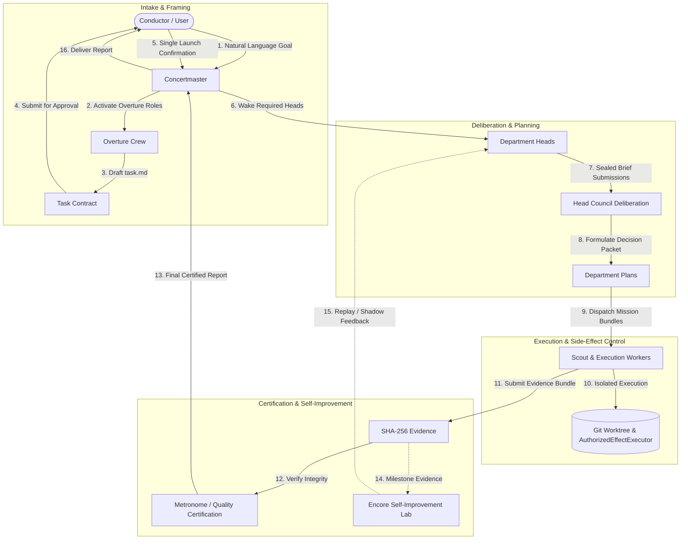

<p align="center">
  <a href="docs/README.md">
    
  </a>
</p>

<h3 align="center">
Maestro: Self-Improving &amp; Durable Agent Orchestration for Versatile Tasks
</h3>
<p align="center">
  <a href="docs/ko/README.md"><b>한국어 (ko)</b></a> &bull;
  <a href="docs/en/README.md"><b>English (en)</b></a> &bull;
  <a href="docs/en/01-system-overview.md"><b>Architecture</b></a> &bull;
  <a href="docs/en/02-hierarchical-orchestration.md"><b>Hierarchy</b></a> &bull;
  <a href="docs/en/04-security-and-authority-model.md"><b>Security Model</b></a> &bull;
  <a href="docs/en/05-roadmap-and-phase-status.md"><b>Roadmap</b></a>
</p>

<p align="center">
  
  
  
  
</p>

---

> **Languages:** [**English (en)**](docs/en/README.md) | [**한국어 (ko)**](docs/ko/README.md)

Maestro is an open-source enterprise AI orchestration framework designed for reliable, long-running, multi-agent goal execution. Its current conversation path is owned by the **Maestro native agent runtime** and an authenticated provider gateway. All execution paths are owned by the native Maestro runtime and authenticated model gateway. Maestro models real human organization structures—incorporating separation of powers, permanent domain departments, monotonic fencing leases, and cryptographic auditability to ensure zero unapproved side effects.

## Current Runtime Boundary

- **Conversation path:** `MaestroAgentRuntime` in the Control Plane, using the authenticated `apps/model-gateway` process.
- **Provider authentication:** API keys stay in the gateway credential store. OpenAI ChatGPT subscription login is delegated to the documented Codex app-server; Maestro persists only login metadata and state.
- **Worker path:** `ExecutionKernelPort` uses the authenticated Model Gateway transport; Ensemble Router selection is not implemented. Every admission carries host context, capability grant, model policy, account binding, and idempotency. Production host tools are not registered yet; unregistered tools fail closed and native Workers are text/evidence-only.
- **Terminal UI:** `@earendil-works/pi-tui` is used for presentation only and has no execution authority.

## Ensemble Router implementation status

The repository contains the routing **artifact contracts**, not a production selector. The verified boundary is:

- **A capability:** eight-axis `0..200` domain vector/validator with explicit `unproven` entries ([`packages/domain/src/model-profile.ts`](packages/domain/src/model-profile.ts)).
- **D demand:** Head-declared `TaskDemand` domain and wire contracts with provenance ([`packages/domain/src/task-demand.ts`](packages/domain/src/task-demand.ts), [`packages/contracts/src/index.ts`](packages/contracts/src/index.ts)).
- **E work character/pressure:** domain contract and continuous pressure calculation ([`packages/domain/src/work-character.ts`](packages/domain/src/work-character.ts)); pressure bands are a separate projection.
- **B provider facts:** domain and wire schema ([`packages/domain/src/provider-facts.ts`](packages/domain/src/provider-facts.ts), [`packages/contracts/src/index.ts`](packages/contracts/src/index.ts)).
- **C operational overlay:** domain and wire schema with a pure per-Goal snapshot helper ([`packages/domain/src/operational-overlay.ts`](packages/domain/src/operational-overlay.ts), [`packages/contracts/src/index.ts`](packages/contracts/src/index.ts)).
- **Four pressure bands:** domain and wire schema ([`packages/domain/src/pressure-band.ts`](packages/domain/src/pressure-band.ts), [`packages/contracts/src/index.ts`](packages/contracts/src/index.ts)).
- **Human-owned baseline:** `model_map` domain validator and empty [`config/model_map.json`](config/model_map.json).

Persistence migrations, durable overlay/Goal snapshot storage, routing evidence, router selection, fixed-model pin migration, host-tool writes/effects, and live host-tool acceptance are **not implemented**. Current native admission still uses one exact `modelPolicy` identity; `MAESTRO_NATIVE_MODEL` remains an explicit fixed-model pin/routing-off input where required. The native Worker remains text/evidence-only because the production host-tool registry is empty. See the [canonical registry](roadmap/_meta/naming-registry.md) and [Ensemble Router design](roadmap/act-1-foundation/active/2026-09-08-ensemble-router-routing-design.md).

## Core Architecture & Pillars

Maestro is built around four core architectural guarantees:

- **Hierarchical Organization & Separation of Powers:**
  - **Concertmaster (Secretary Office)** orchestrates natural-language goals with the Conductor.
  - **Overture Crew** (6 candidate personas) analyzes requirements and drafts an immutable **Task Contract** (`task.md`).
  - **Permanent Department Heads** (Product, Tech, Security, Quality, Operations) wake on demand and deliberate using **Sealed Submissions**.
  - **Scout & Execution Workers** operate inside isolated Git worktrees under strict least-privilege Mission Bundles.
  - **Independent Quality & Encore (Metronome)** verify evidence and issue cryptographic certifications—executing agents can *never* self-certify.

- **Fail-Closed & Default-Deny Security:**
  - All system actions are strictly categorized (`ordinary`, `critical`, `forbidden`, `ambiguous`).
  - Every tool execution, file modification, or shell execution is gated by **`AuthorizedEffectExecutor`**.
  - Side-effect audit logs are committed to PostgreSQL *before* tool execution (**Audit-Before-Effect**).

- **Durable Control Plane:**
  - **PostgreSQL 17** serves as the sole operational source of truth using append-only domain event sourcing (`goal_events`) and a transactional outbox.
  - **Monotonic Fencing Token Leases** (`goal_leases`) handle signed `bigint` precision to prevent zombie processes and phantom writes.
  - Every mutation is idempotent via public `commandId` / `Idempotency-Key` tracking.

- **Evidence-Driven Self-Improvement & Adaptation:**
  - **Encore Learning & Improvement Lab** curates milestone execution evidence into compact **Improvement Digests**.
  - **Shadow-First & Replay Evaluation:** Proposed prompt guidance, role overlays, and routing updates are evaluated in isolated replay/synthetic shadow runs without live execution authority.
  - **Ten-Axis Persona Adaptation:** Fine-tunes 10 canonical personality traits per role and task class based on empirical quality, safety, latency, and cost deltas.
  - **Bounded & Reversible Rollouts:** Self-improvement is strictly contained and can *never* alter security boundaries, authority permissions, credentials, budget ceilings, or core safety policies.

### End-to-End Orchestration Flow



---

## Getting Started

### Prerequisites

- **Node.js**: `v24.x LTS` or higher
- **npm**: `v10.x` or higher
- **PostgreSQL**: `17.x` (required for persistence & integration tests)
- **Docker**: Optional helper for starting a disposable PostgreSQL instance; tests consume `MAESTRO_TEST_DATABASE_URL` directly.
- **OS**: Linux recommended

### Installation & Build

Clone the repository and install workspace dependencies:

```bash
git clone https://github.com/noth3dev/maestro.git
cd ms
npm install
```

Build all packages using TypeScript project references:

```bash
npm run build
```

Run unit tests across all monorepo workspaces:

```bash
npm test
```

Run full build and test verification:

```bash
npm run check
```

---

## CLI Usage

The Maestro CLI (`apps/cli`) is an authenticated command client for the implemented Control Plane REST API. Unsupported surfaces fail rather than being simulated:

```bash
# Query details for a Goal
node apps/cli/dist/main.js goal get --project-id <projectId> --goal-id <goalId>

# Stream append-only domain events
node apps/cli/dist/main.js events list --project-id <projectId>

# List durable review state for a Goal (all require project/Goal context)
node apps/cli/dist/main.js metronome-challenges list --project-id <projectId> --goal-id <goalId>
node apps/cli/dist/main.js encore-council list --project-id <projectId> --goal-id <goalId>
node apps/cli/dist/main.js certifications list --project-id <projectId> --goal-id <goalId>
node apps/cli/dist/main.js concertmaster-report get --project-id <projectId> --goal-id <goalId>
```

---

## Documentation Index

Full documentation is available in both **English (en)** and **한국어 (ko)**:

- **[Documentation Index (en)](docs/en/README.md)** &bull; **[문서 목차 (ko)](docs/ko/README.md)**
- **System Overview** — Architectural philosophy, design principles, and monorepo structure.
  - [English (en)](docs/en/01-system-overview.md) | [한국어 (ko)](docs/ko/01-system-overview.md)
- **Hierarchical Orchestration** — End-to-end execution flow, departments, personas, sealed briefs, and certification.
  - [English (en)](docs/en/02-hierarchical-orchestration.md) | [한국어 (ko)](docs/ko/02-hierarchical-orchestration.md)
- **Durable Control Plane** — PostgreSQL 17 event sourcing, monotonic leases, fencing tokens, and crash reconciliation.
  - [English (en)](docs/en/03-durable-control-plane.md) | [한국어 (ko)](docs/ko/03-durable-control-plane.md)
- **Security & Authority Model** — Action classification, `AuthorizedEffectExecutor`, and sealed submission snapshots.
  - [English (en)](docs/en/04-security-and-authority-model.md) | [한국어 (ko)](docs/ko/04-security-and-authority-model.md)
- **Roadmap & Phase Status** — Milestone phases (Phases 1–8), usability gates, and the **Luthiery** dynamic MCP extension.
  - [English (en)](docs/en/05-roadmap-and-phase-status.md) | [한국어 (ko)](docs/ko/05-roadmap-and-phase-status.md)
- **Developer & Operations Guide** — Workspace package layout, build/test scripts, and operating protocol guidelines.
  - [English (en)](docs/en/06-developer-and-operations-guide.md) | [한국어 (ko)](docs/ko/06-developer-and-operations-guide.md)

---

## Contributing

We welcome community contributions! Please read our [Contributing Guide](CONTRIBUTING.md) for details on our development workflow, architectural guidelines, and submission protocol.

---

## Security Policy

Please review our [Security Policy](SECURITY.md) for details on vulnerability disclosures, containment boundaries, and dependency advisories.

---

## License

Maestro is fully open source and released under the **GNU Affero General Public License v3.0 (AGPL-3.0)**.  
See the [LICENSE](LICENSE) file for details.
