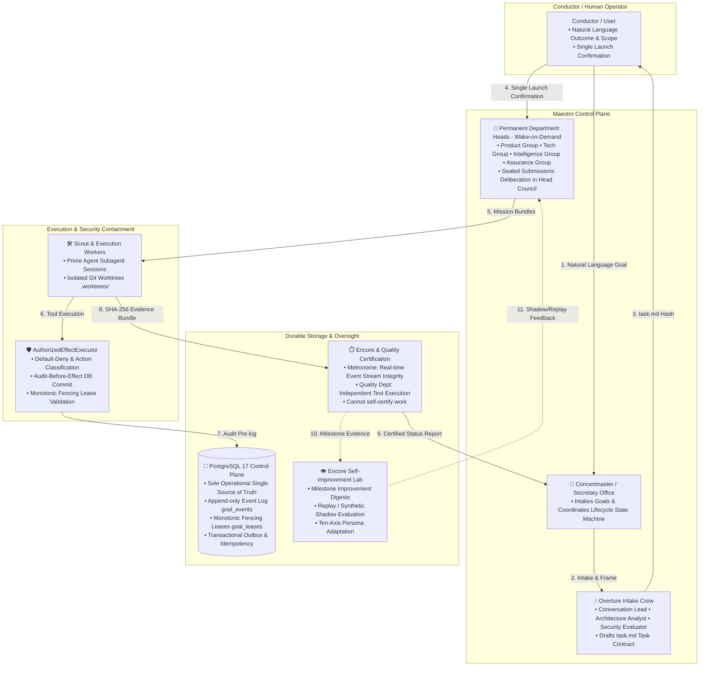

# 01. System Overview

## 1. Architectural Philosophy

Maestro is designed to solve the fundamental unreliability, memory drift, and authority leakage inherent in single-loop agent systems. Rather than relying on a monolithic prompt-loop, Maestro implements an **enterprise organizational model** with strict **separation of powers**, **durable persistence**, and **fail-closed authority gates**.

---

## 2. Core Design Principles

1. **Durable Truth First**: PostgreSQL 17 is the single source of truth for all domain aggregates, events, and transactional outboxes. In-memory states are non-canonical projections.
2. **Separation of Powers**: Executing agents (Workers/Heads) are strictly prohibited from certifying their own work. Verification is handled independently by Quality and Encore (Metronome & Encore Council).
3. **Fail-Closed & Default-Deny Security**: All tool calls and side effects must pass through `AuthorizedEffectExecutor`. Any unclassified, unauthorized, or out-of-scope effect is denied immediately.
4. **Content-Addressed Auditability**: All inputs, plans, briefs, and deliverables are hashed using SHA-256 canonical serialization (`Sealed Submission`), ensuring cryptographically immutable record lineage.
5. **No Speculative Re-invention**: Maestro builds on top of the native features of the **Prime Agent SDK** (session tracking, recursive subagent spawning, tool calling) while keeping domain authority within the control plane.
6. **Evidence-Driven Self-Improvement (Shadow-First Evolution)**: Encore curates execution evidence into compact Improvement Digests to optimize persona axes, role guidance, and routing templates in replay/synthetic shadow runs—without permitting autonomous changes to security authority or safety boundaries.

---

## 3. Prime Agent Boundary vs Control Plane

Maestro maintains a clear boundary between the underlying execution kernel and the control plane:

| Responsibility Area | Prime Agent SDK (`packages/prime-adapter`) | Maestro Control Plane (`apps/control-plane`) |
| :--- | :--- | :--- |
| **Model & Session Management** | Model session lifecycle, prompt submission, token usage, subagent delegation | Goal lifecycle state machine, department assignment, budget ceilings |
| **Tool Execution** | Native skill loading, tool call dispatching, environment execution | Authority checks via `AuthorizedEffectExecutor`, audit pre-logging |
| **Persistence & Truth** | Diagnostic logs, raw session transcripts | PostgreSQL 17 domain event log (`goal_events`), monotonic fencing leases |
| **Oversight & Quality** | Raw agent outputs | Metronome integrity validation, Quality certification, Conductor reporting |

---

## 4. Repository Layout Overview

Maestro is structured as an **npm workspace monorepo**:

* **`apps/control-plane`**: Fastify 5 REST & Server-Sent Events (SSE) server for durable commands and real-time state streaming.
* **`apps/cli`**: Command-line interface providing complete operational parity with the control plane API.
* **`apps/secretary`**: Next.js 16 / React 19 web application (Concertmaster Office) featuring radial portfolio graphs.
* **`apps/discord`** (Discord Daemon): Independent out-of-band Discord daemon for incident detection and system health probes.
* **`packages/domain`**: Pure TypeScript domain aggregates (Goal, TaskContract, HeadCouncil, DepartmentPlan).
* **`packages/contracts`**: Shared Zod schemas, HTTP REST contracts, and SSE event payloads.
* **`packages/persistence`**: PostgreSQL 17 schema definitions, Drizzle ORM queries, and migration files.
* **`packages/authority`**: Authorization engine, action classification matrix, and `AuthorizedEffectExecutor`.
* **`packages/evidence`**: SHA-256 evidence bundle generator and cryptographic verification.
* **`packages/prime-adapter`**: Abstraction layer and ports interfacing with the Prime Agent SDK.
* **`packages/git-adapter`**: Isolated Git worktree manager, branch executor, and diff collector.
* **`packages/api-client`**: Type-safe HTTP and SSE client SDK.
