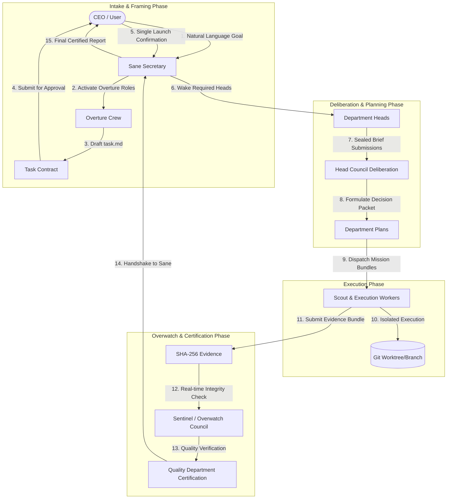

# 02. Hierarchical Orchestration

Maestro models human organizational structures by dividing responsibilities across specialized personas, permanent departments, intake crews, and independent oversight councils.

---

## 1. End-to-End Orchestration Flow



---

## 2. Key Personas and Organizational Roles

### 1) CEO (User / Operator)
* Expresses natural-language outcomes and receives certified status reports.
* **Single Launch Confirmation**: Issues a single approval bound to the exact content hash of the Overture Task Contract (`task.md`).
* Intervenes only when budget limits are breached or `critical` actions require explicit approval.

### 2) Sane (Secretary Office Head)
* Oversees the entire Goal lifecycle and maintains dialogue with the CEO.
* Coordinates state transitions (`draft` ➔ `active` ➔ `completed` / `failed`) without executing code or directly touching repositories.

### 3) Overture Crew (Intake & Contract Drafting)
Activates the minimum required roles from a candidate pool of six specialized personas upon goal creation:
* **Conversation Lead**: Clarifies intent and bounds expectations with the CEO.
* **Architecture Analyst**: Analyzes existing repository topology, code dependencies, and technology stack.
* **External Research Scout**: Researches external documentation and third-party APIs (activated on demand).
* **Security Evaluator**: Maps threat boundaries, budget ceilings, and critical-action expectations.
* **Design & Mock Specialist**: Generates visual wireframes or UI mockups when requested.
* **Task Editor**: Maintains the single, versioned Task Contract file (`task.md`).

---

## 3. Permanent Groups & Departments

Departments possess persistent knowledge and identity, operating on a **Wake-on-Demand** model. Sleeping departments consume no CPU/token resources and receive no active context.

```text
Product Group
  ├── Product Department (Requirements & Product Direction)
  └── Design Department (User Experience & Interface Prototypes)
Tech Group
  ├── Engineering Department (Software Design & Implementation)
  ├── Security Department (Threat Modeling & Auditing)
  └── Infrastructure Department (Environment & Pipeline Tooling)
Intelligence Group
  ├── Research Department (Algorithms & Literature Review)
  └── Data & Analysis Department (Data Pipelines & Metrics Analysis)
Assurance Group
  ├── Quality Department (Independent Verification & Test Execution)
  └── Safety & Compliance Department (Policy Adherence & Safety Constraints)
Operations Group
  └── Operations Department (Runtime Diagnostics & Incident Recovery)
```

---

## 4. Head Council & Sealed Submissions

To eliminate cognitive bias and bandwagon effects during planning, Department Heads deliberate using a **Sealed Submission Protocol**:

1. **Independent Briefs**: Each activated Head writes an independent brief covering Goal interpretation, proposed contribution, dependencies, risks, cost, and time estimates.
2. **Cryptographic Sealing**: Briefs are hashed (`snapshot_hash`) and frozen in PostgreSQL.
3. **Simultaneous Reveal & Deliberation**: Once all assigned Heads submit their briefs, the briefs are revealed simultaneously for up to 2 deliberation rounds.
4. **Convergence Check**: If no new objections surface after 2 consecutive rounds, the council produces a finalized **Department Plan**.

---

## 5. Scout & Execution Workers

* Department Heads spawn workers using Prime Agent subagent APIs.
* Workers operate under **Mission Bundles** defined by least-privilege principles.
* All code modification occurs within isolated Git worktrees (`.worktrees/`).
* Upon completion, workers compile an **Evidence Bundle** containing test logs, diffs, and artifact SHA-256 hashes.

---

## 6. Overwatch & Independent Certification

* **Separation of Verification**: Neither workers nor Department Heads can certify their own output.
* **Sentinel**: Continuously streams domain events and outbox logs to detect process violations, unapproved scope expansion, or fake consensus.
* **Overwatch Council**: Convened for complex cross-department disputes or ambiguous failures.
* **Quality Certification**: The Quality Department independently executes test suites against the final Git commit. A `certified` status is issued only when all criteria match the Task Contract's frozen content hash.
