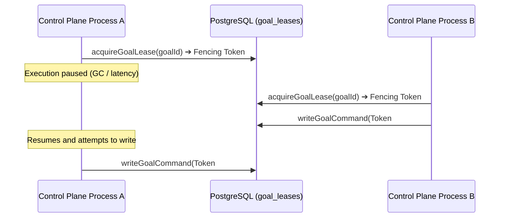

# 03. Durable Control Plane & Durability

Maestro guarantees strict state integrity, crash resilience, and concurrency protection even during process crashes, network partitions, or agent restarts.

---

## 1. System Control Plane Architecture

```text
[HTTP REST / SSE Clients] (Secretary Web / CLI)
          │
          ▼
┌──────────────────────────────────────────────┐
│         apps/control-plane (Fastify)         │
│  - Idempotent Command Routing                │
│  - Lease / Fencing Token Management          │
│  - SSE Global Cursor Stream Replay           │
└──────────────────────┬───────────────────────┘
                       │
                       ▼
┌──────────────────────────────────────────────┐
│           PostgreSQL 17 Database             │
│  (Sole Operational Single Source of Truth)   │
│                                              │
│  ├── goal_leases (Monotonic Bigint Token)    │
│  ├── goal_events (Append-only Event Log)     │
│  ├── goals & projections (Current State)     │
│  └── transactional_outbox (Work Queue)       │
└──────────────────────────────────────────────┘
```

1. **Single Source of Truth**: PostgreSQL 17 is the sole operational source of truth. In-memory data structures are volatile projections.
2. **Append-Only Event Sourcing**: Every state transition writes an immutable event row to `goal_events`. Records are never mutated or deleted.
3. **Transactional Outbox**: Side-effect triggers, notifications, and worker tasks are committed in the exact same DB transaction as the domain event, ensuring zero lost events.

---

## 2. Monotonic Fencing Token Leases

To eliminate phantom writes caused by delayed network responses, garbage collection pauses, or zombie processes, Maestro enforces **Monotonic Fencing Token Leases** (`goal_leases`).



### Key Lease Rules
* **Signed Bigint Precision (`1..9223372036854775807`)**: To prevent JavaScript `Number` IEEE 754 precision loss, tokens are stored as PostgreSQL `bigint` and handled strictly as decimal strings in code.
* **Atomic Proof Verification**: Writes validate that the caller's fencing token matches the database lease record within a single SQL transaction.
* **Strict Range Bound Check**: Fencing tokens exceeding the signed 64-bit integer limit are rejected at the input boundary as `StaleGoalLeaseError`.

---

## 3. Idempotent Command Pipeline

Every mutating API request requires a unique `commandId` (sent via the `Idempotency-Key` header).

* **Identical `commandId` + Identical Payload**: Returns the cached result receipt immediately without re-executing logic.
* **Identical `commandId` + Modified Payload**: Rejects the request with `409 command_id_reused` to prevent command tampering.

---

## 4. Re-connection & Crash Reconciliation

When a process crashes or restarts:

```mermaid
flowchart TD
    CRASH[Process Crash / Shutdown] --> RESTART[Control Plane Boot]
    RESTART --> SCAN[Scan Active Goals & Leases]
    
    SCAN --> CHECK{Is Existing Lease Active?}
    CHECK -->|Lease Active| WAIT[Log lease_contended & Wait Expiry]
    CHECK -->|Lease Expired| RECOVER[Issue Monotonic Token & Acquire Lease]
    
    RECOVER --> AUDIT[Reconcile Pending Events & Outbox]
    RESUME[Resume Goal Execution Safely] <-- AUDIT
```

1. **Graceful Takeover**: Active leases are respected until expiration, preventing split-brain lockup.
2. **Stale Proof Invalidation**: Restart invalidates all previous fencing tokens automatically.
3. **SSE Resumption**: Server-Sent Event (SSE) clients reconnect using `Last-Event-ID` pointing to `goal_events.global_position`, guaranteeing zero dropped event notifications.
