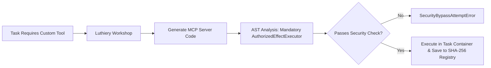

# 05. Roadmap & Phase Status

Maestro follows a strict phased milestone roadmap. Code completion alone does not constitute phase acceptance—each phase requires empirical proof passing real PostgreSQL integration suites and operational usability exit gates.

---

## 1. Multi-Phase Roadmap Matrix

| Phase | Title | Code Status | Verification & Operational Exit Gate |
| :--- | :--- | :---: | :--- |
| **Phase 1** | Technical Foundation & Durable Control Plane | **Implementation gate complete; host-tool product gate open** | G1–G6 implementation evidence is complete, including real PostgreSQL TUI/API parity and SSE cursor-safe reconnect. Production host-tool registration/enforcement remains intentionally deferred to the Phase 2 IPython contract; no final product acceptance is claimed from code evidence alone. |
| **Phase 2** | Concertmaster Office Core & Hierarchical Execution | **Plan 2 S6 verified; documentation sync complete; live acceptance pending** | Plan 2 S6 provides the persistent IPython host-tool, approval hierarchy, full-access modes, and recovery evidence. The live acceptance flow remains a user-run gate; historical code-level completion markers are not current product acceptance. |
| **Phase 3** | Encore, Certification & First Usable Release | **Implementation complete; user-owned live handoff pending** | Plan 2 (host-tool, approval hierarchy, worker repair hold/requeue) and plan-3 §S1–§S4/§S3b are all merged. Routing evidence gates certification, Metronome observes approvals, Council records actual diversity, the TUI design pass landed. §S4's Step 9→10 CI harness remains a fake-provider simulation (recorded limitation); Phase 3 acceptance now rests solely on the user running the real fourteen-step live-provider scenario. |
| **Phase 4** | Isolated Environments, Devices & Discord Incidents | **Implementation complete; live acceptance skipped (incomplete)** | Plan 4 S1–S4 implementation evidence is merged through `2631ed4`, including Goal-scoped gates, restart deduplication, and the [`test/phase4-scenario/RUNBOOK.md`](../test/phase4-scenario/RUNBOOK.md). The user-owned live handoff was skipped; no live activation, outage/restart, provider/device effect, or certification evidence is claimed. |
| **Phase 5** | Concurrent Goals & Portfolio Control | **Active remediation / capacity work** | Flat per-project worker admission control is present. Resource inventory, demand reservations, protected floors, and portfolio scheduling remain future work. |
| **Phase 6** | Encore Learning & 10-Axis Adaptation | **Full-chain proof accepted** *(Steps 1–11)* | Durable routing and persona paths are proven through candidate evaluation, replay/synthetic/shadow, independent Council, proposal/bounded rollout, measured result, rollback, source-loss safety, and worker-profile consumption. |
| **Phase 7** | Full Concertmaster Office & Radial Control Surface | **Mechanically verified; §S9 exit gate complete; user visual/interaction handoff pending** | Phase 7 implementation slices §S1–§S9 are merged. §S9 is the mechanical phase exit gate; evidence includes implementation `cf4108d`, branding repair `544623f`, and forbidden-token repair `417f359` with independent `REVIEW: PASS`. Post-repair build, lint, `git diff --check`, and authenticated serialized PostgreSQL verification passed 290/290 files and 1917/1917 tests, exit 0, 637.86s (`/tmp/plan7-s9-repair-pg.log`). No live-provider acceptance is claimed; remaining visual/interaction judgment is a user-owned handoff, not a mechanical test claim. Electron + Vite + React 19 remains the target; Next.js/PWA is not the current target. |
| **Phase 8** | Full-System Hardening & Release Certification | Planned | Adversarial stress testing, security penetration audit, recovery verification, release candidate freeze. |

### Phase 7 §S9 exit-gate evidence

Phase 7 implementation slices §S1–§S9 are merged, and §S9 is the mechanical phase exit gate. Evidence is implementation merge `cf4108d`, branding repair merge `544623f`, and follow-up forbidden-token repair `417f359` with independent `REVIEW: PASS`; post-repair build, lint, `git diff --check`, and authenticated serialized PostgreSQL verification passed **290/290 files and 1917/1917 tests**, exit 0, in **637.86s** (`/tmp/plan7-s9-repair-pg.log`). No live-provider acceptance is claimed. Remaining visual/interaction judgment is a user-owned handoff, not a mechanical test claim.

### Native agent backend migration — current boundary

The Maestro native runtime and authenticated model gateway own conversation and worker execution. Durable ChatGPT account-login recovery is integrated, including fenced status/cancel operations and metadata-only persistence. Native execution admissions carry host context, immutable grants, exact provider-qualified model policy, account binding, and idempotency; every native call site (Worker, Head, semantic review, Encore reviewers, and team-lead helpers) records selected/actual model and gateway-binding identity in the append-only `native_execution_bindings` table. A clean single-worker real-PostgreSQL rerun passed **162/162 files, 1066/1066 tests, 0 failed** (2026-09-09), including kill/restart recovery, fencing, authority denial, and loopback Model Gateway HTTP acceptance. The real Control Plane + PostgreSQL + Model Gateway Worker scenario also passes (`apps/control-plane/src/native-worker-acceptance.integration.test.ts`). The remaining Phase 1 product gate is production host-tool registration/enforcement: `ToolRegistry` is fail-closed but production composition intentionally registers no Maestro callback tools, and the Codex adapter remains read-only text generation until the tool contract is approved.

The CLI TUI uses `@earendil-works/pi-tui` terminal primitives. This is a presentation dependency with no provider or execution authority.

### Production IPython host-tool boundary — 2026-09-09

The first production host-tool slice belongs to Phase 2 and follows Prime Agent's execution shape without reintroducing Prime Agent: one persistent `ipython` surface, session-local Python functions, explicit project skill saving, and direct structured tools only where a stable authority contract is required.

- Phase 2 covers local project files, local Git, tests, local shell commands, and local environment changes.
- The default session is limited to the Goal worktree and declared temporary directories. The user may activate full local access per session, choosing whether intermediate Head and Encore approvals remain enabled or are skipped.
- The approval hierarchy is independent execution → active Department Head → Encore Council → user. Ambiguous work and Encore disagreement escalate to the user. A mixed-risk IPython block uses its highest required tier and never partially executes.
- Approval scope is selectable: one execution, bounded count/time/budget, or session duration. All decisions and effects are recorded; user stop remains available. `forbidden` actions remain denied.
- Phase 4 separately activates external capabilities one at a time. Phase 6 remains the later evidence-driven refinement boundary; Phase 9 Luthiery remains the future dynamic MCP workshop.

### Phase 6 Step 1 — Accepted Boundary

Phase 6 Step 1 is accepted as an immutable, project-private Improvement Digest slice. Each digest is source-bound to a Goal and its project, protected by lease authority and membership-scoped reads, and validated against its canonical content hash. This slice does **not** perform automatic mutation, replay, rollout, persona adaptation, or cross-project promotion. Phase 6 Steps 2+ remain deferred until separately planned, implemented, reviewed, and accepted.

---

### Phase 6 full-chain evidence — accepted 2026-09-14

The S11 real-PostgreSQL scenario is `test/phase6-scenario/full-chain.integration.test.ts`. It records both evidence paths and asserts durable joins rather than reconstructing them in memory:

- Routing: Improvement Digest IDs → routing candidate/version/content hash → replay/synthetic/shadow evidence → independent multi-model Council judgments → judged proposal → class-enabled bounded rollout → protected-metric rollback to the exact rollback target. The routing capability baseline remains unchanged.
- Persona: Improvement Digest IDs → persona candidate/version/content hash → replay/synthetic/shadow evidence with zero live effects → independent multi-model Council approval → judged candidate → class-enabled task-class application → measured certification. `deriveWorkerProfileForMission` reads the applied task-class template for a real bound Worker; a Metronome challenge carries the Head-selected council/department/plan/item target.
- Safety: malformed authority/core-identity candidates are rejected before evaluator callbacks; retired source evidence blocks new rollout and rolls back an active rollout while preserving append-only candidate, evaluation, Council, and rollout history. `readImprovementCandidateDecisionHistory` supplies the durable candidate/evaluation/Council/rollout projection for history views.

Focused S11 verification passed: **20/20 PostgreSQL integration tests**, plus `npm run build`, `npm run lint`, and `git diff --check`. The full serialized suite and post-merge verification are recorded in `roadmap/act-1-foundation/active/operations/progress.md`.

## Act-by-Act status (2026-09-09)

| Act | Current status | Ensemble Router / runtime boundary |
| --- | --- | --- |
| **Act 1 — Foundation** | **Implementation gate complete; not certified** | A/D/E contracts, B provider facts, C operational overlay with pure Goal snapshot, four pressure-band schemas, and the human-owned empty `model_map` baseline are present. S1/S2/S3 evidence is merged and green, including G6 real PostgreSQL TUI/API parity, cursor-safe SSE reconnect, and explicit authorization/unavailable failures. Production selector/native-admission wiring, fixed-model evidence migration, host-tool writes/effects, and live acceptance remain open; Phase 1 is not finally accepted. See [`roadmap/act-1-foundation/README.md`](../roadmap/act-1-foundation/README.md). |
| **Act 2 — Flashmob** | **Blocked on Act 1 certification** | No Flashmob production path or automatic Ensemble Router selection is claimed. See [`roadmap/act-2-flashmob/README.md`](../roadmap/act-2-flashmob/README.md). |
| **Act 3 — Arrangement** | **Deferred** | Personalized self-modification remains downstream of Act 2 and does not promote routing or model-map changes automatically. See [`roadmap/act-3-arrangement/README.md`](../roadmap/act-3-arrangement/README.md). |

## 2. Operational Usability Audit Notice

> [!IMPORTANT]
> **Operational Usability Gate Disclaimer:**  
> Code and PostgreSQL evidence are not the same as a release claim. The native conversation and Worker paths now have real Model Gateway and PostgreSQL acceptance coverage, including restart/fencing evidence. TUI parity/reconnect evidence is now complete through G6. Remaining gates are explicit: product approval and implementation of production host tools, and independent review/production acceptance of the separately running authenticated device-agent protocol (the real-process gate itself is implemented). These items are tracked in `roadmap/act-1-foundation/active/operations/task_plan.md`, not hidden behind a generic “code complete” label.

---

## 3. Post-Phase 8 Extensions

### 1) Luthiery (Dynamic MCP Workshop)

**Luthiery** (Phase 9 candidate) enables agents to generate, audit, run, and reuse specialized **Model Context Protocol (MCP)** servers dynamically during task execution without compromising core safety boundaries ([`roadmap/act-1-foundation/phase-09-luthiery.md`](../roadmap/act-1-foundation/phase-09-luthiery.md)).

#### Core Luthiery Principles
1. **Organizational Separation**: Placed under the **Operations / Infrastructure Group**. Strictly separated from Encore to avoid self-auditing conflicts of interest.
2. **Container Sandbox Binding**: Dynamic MCP server processes run inside Phase 4 containers, bound directly to the Goal's fencing token lease (`SIGTERM` cleanup on expiry).
3. **AST Static Enforcement**: Generated handler code must explicitly include `AuthorizedEffectExecutor.execute()` wrappers, failing static analysis otherwise.
4. **Content-Addressed Reuse**: Certified MCP server binaries are indexed in `packages/evidence` using SHA-256 hashes for instant zero-latency reuse in future goals.

---

### 2) Autonomous Treasury & Real Capital Wallet

**Autonomous Treasury** (Phase 9/10 candidate) embeds a durable, system-managed wallet into Maestro, granting the orchestration system real financial capability to autonomously pay for APIs, cloud computing resources, and Web3 smart contract interactions using pre-funded capital ([`roadmap/act-1-foundation/phase-10-autonomous-treasury.md`](../roadmap/act-1-foundation/phase-10-autonomous-treasury.md)).

#### Core Treasury Principles
1. **Pre-funded Capital Model**: Orchestration operates on user-funded/pre-charged capital (Web3 crypto assets & traditional fiat payment rails like Stripe/Plaid).
2. **Treasury Department Ownership**: Managed under the **Operations / Finance Group (Treasury Department)**, allocating spend ceilings per goal during Head Council planning.
3. **Autonomous Execution with Optional 2-Step Gate**: Standard in-budget spend executes autonomously via `payment.spend` actions; high-value payments can enforce an optional 2-step Conductor approval threshold.
4. **Audit-Before-Spend & Metronome Monitoring**: Transaction intents and double-entry receipts are immutably logged in PostgreSQL before network dispatch, monitored continuously by **Metronome** for unusual spend velocity.
