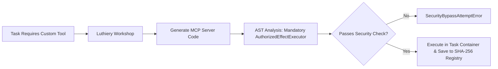

# 05. Roadmap & Phase Status

Maestro follows a strict phased milestone roadmap. Code completion alone does not constitute phase acceptance—each phase requires empirical proof passing real PostgreSQL integration suites and operational usability exit gates.

---

## 1. Multi-Phase Roadmap Matrix

| Phase | Title | Code Status | Verification & Operational Exit Gate |
| :--- | :--- | :---: | :--- |
| **Phase 1** | Technical Foundation & Durable Control Plane | **Operational gate: one product decision open** | REST/SSE API, PostgreSQL 17 durability, fencing, native runtime/provider-gateway boundary, real worker acceptance, and clean full-suite evidence are complete. Production host-tool registration remains intentionally unimplemented pending an approved tool/data/effect contract. |
| **Phase 2** | Concertmaster Office Core & Hierarchical Execution | **Implemented and PostgreSQL-verified** | Overture intake, Task Contract identity, Head Council sealed deliberation, Department Plans, Mission Bundles, native Worker admission, and isolated Git execution are covered. Final release acceptance is governed by the later operational gates. |
| **Phase 3** | Encore, Certification & First Usable Release | **Implemented; release gate open** | Metronome loop, Encore adjudication, independent Quality certification, reports, CLI/API parity, and native process evidence exist. TUI end-to-end parity, host-tool scope, and release-level recovery evidence remain explicit gates. |
| **Phase 4** | Isolated Environments, Devices & Discord Incidents | **Implemented; independent acceptance pending** | Environment/browser/Discord slices and a separately running authenticated device-agent live gate have evidence. Independent review and production deployment acceptance remain. |
| **Phase 5** | Concurrent Goals & Portfolio Control | **Active remediation / capacity work** | Flat per-project worker admission control is present. Resource inventory, demand reservations, protected floors, and portfolio scheduling remain future work. |
| **Phase 6** | Encore Learning & 10-Axis Adaptation | **Step 1 accepted** *(immutable digest)* | Step 1: project-private, source-bound Improvement Digests. Steps 2+ (replay, mutation, rollout, adaptation, promotion) remain deferred. |
| **Phase 7** | Full Concertmaster Office & Radial Control Surface | Planned | Next.js 16 / React 19 web application, `@xyflow/react` radial portfolio visualization, real-time SSE interaction. |
| **Phase 8** | Full-System Hardening & Release Certification | Planned | Adversarial stress testing, security penetration audit, recovery verification, release candidate freeze. |

### Native agent backend migration — current boundary

The Maestro native runtime and authenticated model gateway own conversation and worker execution. Durable ChatGPT account-login recovery is integrated, including fenced status/cancel operations and metadata-only persistence. Native execution admissions carry host context, immutable grants, exact provider-qualified model policy, account binding, and idempotency; every native call site (Worker, Head, semantic review, Encore reviewers, and team-lead helpers) records selected/actual model and gateway-binding identity in the append-only `native_execution_bindings` table. A clean single-worker real-PostgreSQL rerun passed **162/162 files, 1066/1066 tests, 0 failed** (2026-09-08), including kill/restart recovery, fencing, authority denial, and loopback Model Gateway HTTP acceptance. The real Control Plane + PostgreSQL + Model Gateway Worker scenario also passes (`apps/control-plane/src/native-worker-acceptance.integration.test.ts`). The remaining Phase 1 product gate is production host-tool registration/enforcement: `ToolRegistry` is fail-closed but production composition intentionally registers no Maestro callback tools, and the Codex adapter remains read-only text generation until the tool contract is approved.

The CLI TUI uses `@earendil-works/pi-tui` terminal primitives. This is a presentation dependency with no provider or execution authority.

### Phase 6 Step 1 — Accepted Boundary

Phase 6 Step 1 is accepted as an immutable, project-private Improvement Digest slice. Each digest is source-bound to a Goal and its project, protected by lease authority and membership-scoped reads, and validated against its canonical content hash. This slice does **not** perform automatic mutation, replay, rollout, persona adaptation, or cross-project promotion. Phase 6 Steps 2+ remain deferred until separately planned, implemented, reviewed, and accepted.

---

## 2. Operational Usability Audit Notice

> [!IMPORTANT]
> **Operational Usability Gate Disclaimer:**  
> Code and PostgreSQL evidence are not the same as a release claim. The native conversation and Worker paths now have real Model Gateway and PostgreSQL acceptance coverage, including restart/fencing evidence. Remaining gates are explicit: product approval and implementation of production host tools; TUI parity/reconnect evidence; and independent review/production acceptance of the separately running authenticated device-agent protocol (the real-process gate itself is implemented). These items are tracked in `plan/operations/task_plan.md`, not hidden behind a generic “code complete” label.

---

## 3. Post-Phase 8 Extensions

### 1) Luthiery (Dynamic MCP Workshop)

**Luthiery** (Phase 9 candidate) enables agents to generate, audit, run, and reuse specialized **Model Context Protocol (MCP)** servers dynamically during task execution without compromising core safety boundaries ([`plan/post-phase8-ideas.md`](../plan/post-phase8-ideas.md)).

#### Core Luthiery Principles
1. **Organizational Separation**: Placed under the **Operations / Infrastructure Group**. Strictly separated from Encore to avoid self-auditing conflicts of interest.
2. **Container Sandbox Binding**: Dynamic MCP server processes run inside Phase 4 containers, bound directly to the Goal's fencing token lease (`SIGTERM` cleanup on expiry).
3. **AST Static Enforcement**: Generated handler code must explicitly include `AuthorizedEffectExecutor.execute()` wrappers, failing static analysis otherwise.
4. **Content-Addressed Reuse**: Certified MCP server binaries are indexed in `packages/evidence` using SHA-256 hashes for instant zero-latency reuse in future goals.

---

### 2) Autonomous Treasury & Real Capital Wallet

**Autonomous Treasury** (Phase 9/10 candidate) embeds a durable, system-managed wallet into Maestro, granting the orchestration system real financial capability to autonomously pay for APIs, cloud computing resources, and Web3 smart contract interactions using pre-funded capital ([`plan/post-phase8-ideas.md`](../plan/post-phase8-ideas.md)).

#### Core Treasury Principles
1. **Pre-funded Capital Model**: Orchestration operates on user-funded/pre-charged capital (Web3 crypto assets & traditional fiat payment rails like Stripe/Plaid).
2. **Treasury Department Ownership**: Managed under the **Operations / Finance Group (Treasury Department)**, allocating spend ceilings per goal during Head Council planning.
3. **Autonomous Execution with Optional 2-Step Gate**: Standard in-budget spend executes autonomously via `payment.spend` actions; high-value payments can enforce an optional 2-step Conductor approval threshold.
4. **Audit-Before-Spend & Metronome Monitoring**: Transaction intents and double-entry receipts are immutably logged in PostgreSQL before network dispatch, monitored continuously by **Metronome** for unusual spend velocity.
