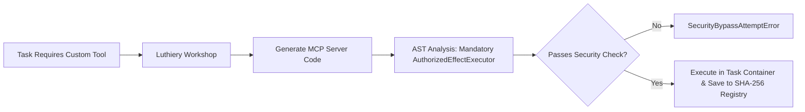

# 05. Roadmap & Phase Status

Maestro follows a strict phased milestone roadmap. Code completion alone does not constitute phase acceptance—each phase requires empirical proof passing real PostgreSQL integration suites and operational usability exit gates.

---

## 1. Multi-Phase Roadmap Matrix

| Phase | Title | Code Status | Verification & Operational Exit Gate |
| :--- | :--- | :---: | :--- |
| **Phase 1** | Technical Foundation & Durable Control Plane | **Code Complete** | Fastify REST/SSE API, PostgreSQL 17 event sourcing, monotonic fencing leases, Prime Agent adapter isolation. |
| **Phase 2** | Concertmaster Office Core & Hierarchical Execution | **Code Complete** | Overture Crew intake flow, Task Contract identity, Head Council sealed deliberation, Department Plans, isolated Git execution. |
| **Phase 3** | Encore, Certification & First Usable Release | **Code Complete** | Metronome live event monitoring, Encore Council adjudication, independent Quality certification, Concertmaster report generation, CLI/App API parity. |
| **Phase 4** | Isolated Environments, Devices & Discord Incidents | **Code Complete** *(Self-verified)* | Declarative container recipes, Playwright browser isolation, enrolled device authorization, Discord out-of-band incident detection. |
| **Phase 5** | Concurrent Goals & Portfolio Control | Planned | Multi-goal isolation, budget/compute contention scheduling, Portfolio Council priority management. |
| **Phase 6** | Encore Learning & 10-Axis Adaptation | Planned | Offline replay lab, 10-axis persona tuning, synthetic evaluation, curated knowledge propagation. |
| **Phase 7** | Full Concertmaster Office & Radial Control Surface | Planned | Next.js 16 / React 19 web application, `@xyflow/react` radial portfolio visualization, real-time SSE interaction. |
| **Phase 8** | Full-System Hardening & Release Certification | Planned | Adversarial stress testing, security penetration audit, recovery verification, release candidate freeze. |

---

## 2. Operational Usability Audit Notice

> [!IMPORTANT]
> **Operational Usability Gate Disclaimer:**  
> While domain and persistence unit test suites for Phases 1–4 are green, an independent operational usability audit (`task_plan.md`) established that Phase 1–3 control plane features remain gated behind operational usability requirements (e.g., end-to-end service API execution pathways, real effect executor wiring for Git, and continuous Metronome observation). Phase 4 device controls similarly await live device agent protocol wiring. Implementation of these operational usability tracks is tracked under the **Phase 5 Remediation Plan**.

---

## 3. Post-Phase 8 Extensions

### 1) Luthiery (Dynamic MCP Workshop)

**Luthiery** (Phase 9 candidate) enables agents to generate, audit, run, and reuse specialized **Model Context Protocol (MCP)** servers dynamically during task execution without compromising core safety boundaries ([`plan/post-phase8-ideas.md`](file:///home/ubuntu/projects/ms/plan/post-phase8-ideas.md)).

#### Core Luthiery Principles
1. **Organizational Separation**: Placed under the **Operations / Infrastructure Group**. Strictly separated from Encore to avoid self-auditing conflicts of interest.
2. **Container Sandbox Binding**: Dynamic MCP server processes run inside Phase 4 containers, bound directly to the Goal's fencing token lease (`SIGTERM` cleanup on expiry).
3. **AST Static Enforcement**: Generated handler code must explicitly include `AuthorizedEffectExecutor.execute()` wrappers, failing static analysis otherwise.
4. **Content-Addressed Reuse**: Certified MCP server binaries are indexed in `packages/evidence` using SHA-256 hashes for instant zero-latency reuse in future goals.

---

### 2) Autonomous Treasury & Real Capital Wallet

**Autonomous Treasury** (Phase 9/10 candidate) embeds a durable, system-managed wallet into Maestro, granting the orchestration system real financial capability to autonomously pay for APIs, cloud computing resources, and Web3 smart contract interactions using pre-funded capital ([`plan/post-phase8-ideas.md`](file:///home/ubuntu/projects/ms/plan/post-phase8-ideas.md)).

#### Core Treasury Principles
1. **Pre-funded Capital Model**: Orchestration operates on user-funded/pre-charged capital (Web3 crypto assets & traditional fiat payment rails like Stripe/Plaid).
2. **Treasury Department Ownership**: Managed under the **Operations / Finance Group (Treasury Department)**, allocating spend ceilings per goal during Head Council planning.
3. **Autonomous Execution with Optional 2-Step Gate**: Standard in-budget spend executes autonomously via `payment.spend` actions; high-value payments can enforce an optional 2-step Conductor approval threshold.
4. **Audit-Before-Spend & Metronome Monitoring**: Transaction intents and double-entry receipts are immutably logged in PostgreSQL before network dispatch, monitored continuously by **Metronome** for unusual spend velocity.
