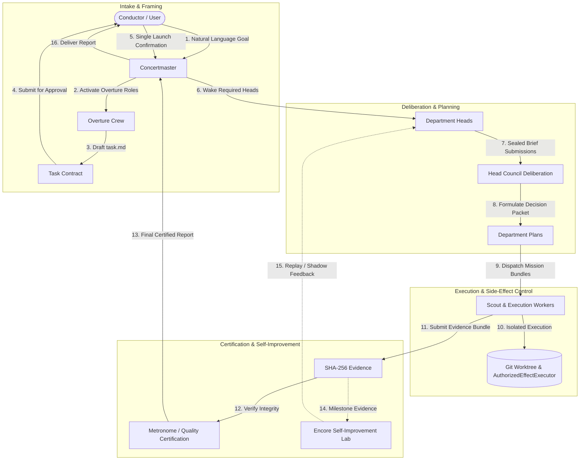

<p align="center">
  <a href="../README.md">
    
  </a>
</p>

<h3 align="center">
Maestro: Self-Improving &amp; Durable Agent Orchestration for Versatile Tasks
</h3>
<p align="center">
  <a href="en/README.md"><b>Documentation (EN)</b></a> &bull;
  <a href="ko/README.md"><b>문서 (한국어)</b></a> &bull;
  <a href="01-system-overview.md"><b>Architecture</b></a> &bull;
  <a href="02-hierarchical-orchestration.md"><b>Hierarchy</b></a> &bull;
  <a href="04-security-and-authority-model.md"><b>Security Model</b></a> &bull;
  <a href="05-roadmap-and-phase-status.md"><b>Roadmap</b></a>
</p>

<p align="center">
  
  
  
  
</p>

---

Maestro is an open-source enterprise AI orchestration framework designed for reliable, long-running, multi-agent goal execution. Built on top of the **Prime Agent SDK**, Maestro models real human organization structures—incorporating separation of powers, permanent domain departments, monotonic fencing leases, and cryptographic auditability to ensure zero unapproved side effects.

## Core Architecture & Pillars

Maestro is built around four core architectural guarantees:

- **Hierarchical Organization & Separation of Powers:**
  - **Concertmaster (Secretary Office)** orchestrates natural-language goals with the Conductor.
  - **Overture Crew** (6 candidate personas) analyzes requirements and drafts an immutable **Task Contract** (`task.md`).
  - **Permanent Department Heads** (Product, Tech, Security, Quality, Operations) wake on demand and deliberate using **Sealed Submissions**.
  - **Scout & Execution Workers** operate inside isolated Git worktrees under strict least-privilege Mission Bundles.
  - **Independent Quality & Encore (Metronome)** verify evidence and issue cryptographic certifications—executing agents can *never* self-certify.

- **Fail-Closed & Default-Deny Security:**
  - All system actions are strictly categorized (`ordinary`, `critical`, `forbidden`, `ambiguous`).
  - Every tool execution, file modification, or shell execution is gated by **`AuthorizedEffectExecutor`**.
  - Side-effect audit logs are committed to PostgreSQL *before* tool execution (**Audit-Before-Effect**).

- **Durable Control Plane:**
  - **PostgreSQL 17** serves as the sole operational source of truth using append-only domain event sourcing (`goal_events`) and a transactional outbox.
  - **Monotonic Fencing Token Leases** (`goal_leases`) handle signed `bigint` precision to prevent zombie processes and phantom writes.
  - Every mutation is idempotent via public `commandId` / `Idempotency-Key` tracking.

- **Evidence-Driven Self-Improvement & Adaptation:**
  - **Encore Learning & Improvement Lab** curates milestone execution evidence into compact **Improvement Digests**.
  - **Shadow-First & Replay Evaluation:** Proposed prompt guidance, role overlays, and routing updates are evaluated in isolated replay/synthetic shadow runs without live execution authority.
  - **Ten-Axis Persona Adaptation:** Fine-tunes 10 canonical personality traits per role and task class based on empirical quality, safety, latency, and cost deltas.
  - **Bounded & Reversible Rollouts:** Self-improvement is strictly contained and can *never* alter security boundaries, authority permissions, credentials, budget ceilings, or core safety policies.

### End-to-End Orchestration Flow



---

## Getting Started

### Prerequisites

- **Node.js**: `v24.x LTS` or higher
- **npm**: `v10.x` or higher
- **PostgreSQL**: `17.x` (required for persistence & integration tests)
- **Docker**: Required for running disposable test containers (`Testcontainers`)
- **OS**: Linux recommended

### Installation & Build

Clone the repository and install workspace dependencies:

```bash
git clone https://github.com/noth3dev/maestro.git
cd ms
npm install
```

Build all packages using TypeScript project references:

```bash
npm run build
```

Run unit tests across all monorepo workspaces:

```bash
npm test
```

Run full build and test verification:

```bash
npm run check
```

---

## CLI Usage

The Maestro CLI (`apps/cli`) provides operational parity with the control plane REST API:

```bash
# Query details for a Goal
node apps/cli/dist/main.js goal get <goalId>

# Stream append-only domain events
node apps/cli/dist/main.js events list --goalId <goalId>

# Query Sentinel challenges & Encore Council rounds
node apps/cli/dist/main.js sentinel challenge <challengeId>
node apps/cli/dist/main.js council round <roundId>

# Retrieve Quality Certification & Certified Reports
node apps/cli/dist/main.js certification get <certificationId>
node apps/cli/dist/main.js report get <goalId>
```

---

## Documentation Index

- **[System Overview](01-system-overview.md)** — Architectural philosophy, design principles, and monorepo structure.
- **[Hierarchical Orchestration](02-hierarchical-orchestration.md)** — End-to-end execution flow, departments, personas, sealed briefs, and certification.
- **[Durable Control Plane](03-durable-control-plane.md)** — PostgreSQL 17 event sourcing, monotonic leases, fencing tokens, and crash reconciliation.
- **[Security & Authority Model](04-security-and-authority-model.md)** — Action classification, `AuthorizedEffectExecutor`, and sealed submission snapshots.
- **[Roadmap & Phase Status](05-roadmap-and-phase-status.md)** — Milestone phases (Phases 1–8), usability gates, and the **Luthiery** dynamic MCP extension.
- **[Developer & Operations Guide](06-developer-and-operations-guide.md)** — Workspace package layout, build/test scripts, and operating protocol guidelines.

---

## Contributing

We welcome community contributions! Please read our [Contributing Guide](../CONTRIBUTING.md) for details on our development workflow, architectural guidelines, and submission protocol.

---

## Security Policy

Please review our [Security Policy](../SECURITY.md) for details on vulnerability disclosures, containment boundaries, and dependency advisories.

---

## License

Maestro is fully open source and released under the **GNU Affero General Public License v3.0 (AGPL-3.0)**.  
See the [LICENSE](../LICENSE) file for details.
