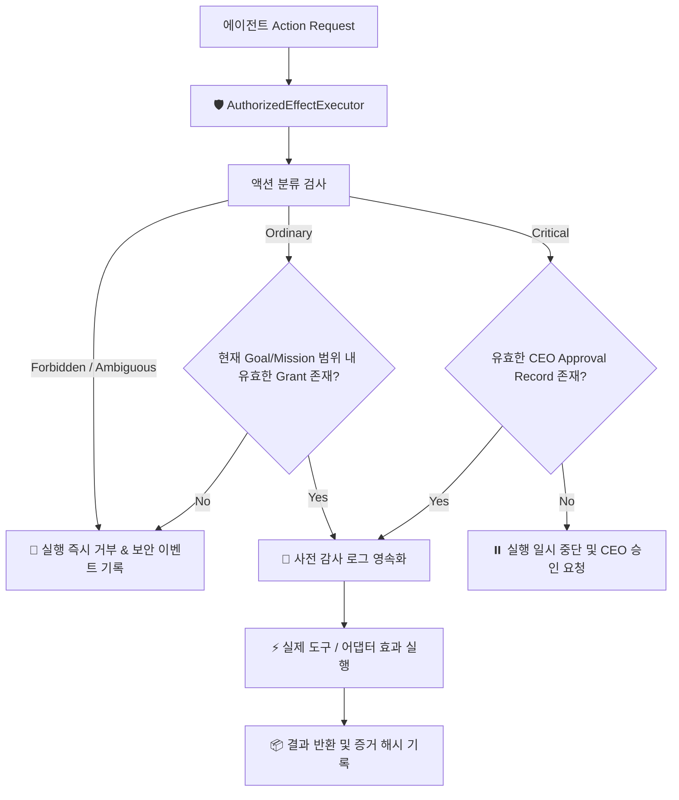
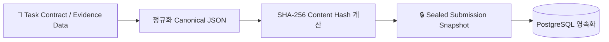

# 보안 및 권한 모델 (Authority & Security)

Maestro는 **Default-Deny(기본 거부)**와 **최소 권한(Least Privilege)**을 원칙으로 하여, 에이전트의 오작동이나 환각으로 인한 파괴적 행위를 원천 방어합니다.

---

## 1. 액션 분류 체계 (Action Classification)

시스템 내에서 실행되는 모든 행위는 사전에 다음과 같이 엄격히 분류됩니다 (`packages/authority/src/authority.ts`).

| 분류 (Classification) | 해당 액션 목록 | 기본 처리 정책 |
| :--- | :--- | :--- |
| **`ordinary`** (일반 작업) | `project.file.edit`, `project.test.run`, `git.local.commit` | 승인된 Task Contract 범위 내에서 Worker가 자율 실행 가능 |
| **`critical`** (위험 작업) | `git.remote.push`, `deployment.release`, `external.send`, `permanent.delete`, `payment.spend`, `authority.change`, `external.connect` | 명시적인 CEO/Authority의 사전 승인(Approval)이 반드시 필요 |
| **`forbidden`** (금지 작업) | `system.policy.bypass`, 임의 권한 상승 시도 | 절대 허용되지 않으며 즉시 거부 및 보안 감사 로그 기록 |
| **`ambiguous`** (모호한 작업) | 사전 정의되지 않은 모든 알 수 없는 액션 | 기본 거부(Deny) 및 추가 검토 요구 |

---

## 2. AuthorizedEffectExecutor 게이트웨이

모든 외부 도구 실행 및 시스템 변경은 반드시 `AuthorizedEffectExecutor`를 통과해야만 합니다.

### 핵심 보안 규칙
1. **Audit-Before-Effect**: 실제 도구(파일 쓰기, 쉘 실행 등)가 동작하기 **전에** DB에 승인 및 실행 의도가 먼저 기록되어야 합니다.
2. **Goal & Lease Binding**: 요청은 현재 유효한 `goalId`, `actorId`, `controlEpoch`와 일치해야 하며 만료된 권한은 즉시 무효화됩니다.
3. **No Hidden Bypass**: 어떠한 어댑터도 도메인 보안 게이트웨이를 우회하여 직접 OS 명령이나 외부 네트워크를 호출할 수 없습니다.

---

## 3. 봉인 제출(Sealed Submission)과 증거 무결성

에이전트 간 담합 및 데이터 위·변조를 방지하기 위한 암호화적 무결성 검증 체계입니다.

* **Canonical JSON 직렬화**: 키 정렬 및 공백 표준화를 통해 JSON 포맷 차이로 인한 해시 불일치를 제거합니다.
* **불변 스냅샷(Immutable Snapshot)**: 심의(Council) 및 인증(Certification)에 사용되는 모든 입력값은 스냅샷 해시(`snapshot_hash`)로 고정되어 사후 수정이 불가능합니다.
* **프로토타입 오염 방지**: `__proto__`, `prototype` 등 위험한 JSON 키 인입 시 즉시 `InvalidSealedSubmissionSnapshotError`를 발생시킵니다.
