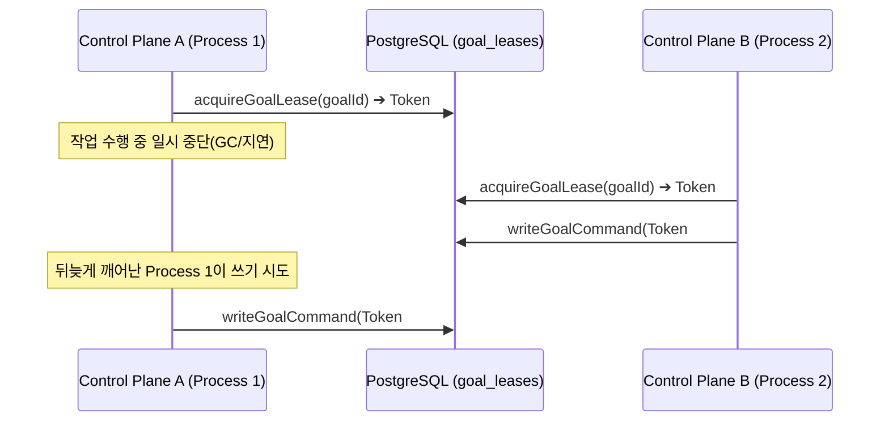
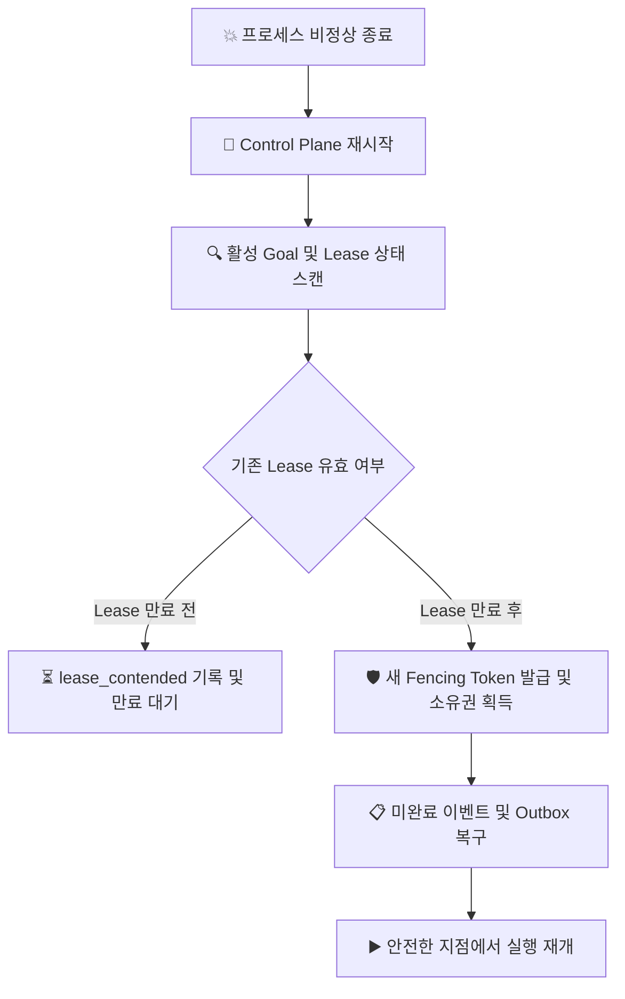

# 내구성 제어 평면 및 장애 복구 (Control Plane & Durability)

Maestro는 프로세스 다운, 메모리 유실, 분산 경합 환경에서도 데이터 일관성과 무결성을 완벽하게 보장하도록 설계되었습니다.

---

## 1. 아키텍처 핵심 원칙

```text
[HTTP REST / SSE Clients] (Secretary Web / CLI)
          │
          ▼
┌──────────────────────────────────────────────┐
│         apps/control-plane (Fastify)         │
│  - Idempotent Command Routing                │
│  - Lease / Fencing Token Management          │
│  - SSE Global Cursor Stream Replay           │
└──────────────────────┬───────────────────────┘
                       │
                       ▼
┌──────────────────────────────────────────────┐
│           PostgreSQL 17 Database             │
│  (Sole Operational Single Source of Truth)   │
│                                              │
│  ├── goal_leases (Monotonic Bigint Token)    │
│  ├── goal_events (Append-only Event Log)     │
│  ├── goals & projections (Current State)     │
│  └── transactional_outbox (Work Queue)       │
└──────────────────────────────────────────────┘
```

1. **단일 신뢰 원천 (Single Source of Truth)**: 모든 상태는 PostgreSQL 17에 영속화되며, 메모리 상태는 DB의 프로젝션일 뿐입니다.
2. **Append-only 이벤트 소싱**: 상태 변경은 `goal_events` 테이블에 순차적으로 기록되며, 이전 기록을 덮어쓰지 않습니다.
3. **트랜잭셔널 아웃박스(Transactional Outbox)**: 외부 알림 및 작업 처리는 비즈니스 상태 변경과 동일한 DB 트랜잭션 내에서 아웃박스에 적재되어 유실을 방지합니다.

---

## 2. 펜싱 토큰 기반 분산 리스 (Monotonic Fencing Tokens)

분산 환경에서 늦게 도착한 패킷이나 좀비 프로세스가 DB를 오염시키는 유령 쓰기(Phantom Write)를 방어하기 위해 **단조 증가 펜싱 토큰**을 사용합니다.



### 구현 규칙
* **PostgreSQL Signed Bigint (`1..9223372036854775807`)**: JS Number의 안전 정수 한계를 넘는 정밀도 문제를 방지하기 위해 Bigint 문자열 단위로 다룹니다.
* **원자적 검증**: 명령 실행 트랜잭션 내에서 현재 레코드의 펜싱 토큰과 요청된 증명(Proof)의 일치 여부를 먼저 검증합니다.

---

## 3. 멱등성 보장 (Idempotent Commands)

모든 상태 변경 요청은 클라이언트로부터 고유한 `commandId` (`Idempotency-Key`)를 수신합니다.

* **동일 `commandId` + 동일 페이로드**: DB에 저장된 최초 실행 결과(Receipt)를 즉시 반환 (중복 실행 방지).
* **동일 `commandId` + 다른 페이로드**: `409 command_id_reused` 에러를 반환하여 의도치 않은 명령 변조를 차단.

---

## 4. 프로세스 재시작 복구 (Reconciliation Lifecycle)

프로세스가 갑작스럽게 비정상 종료(Crash)되거나 재시작될 때의 복구 흐름:



* **Graceful Takeover**: 기존 프로세스의 리스가 아직 유효하다면 강제로 빼앗지 않고 대기하여 경합을 방지합니다.
* **Stale Proof Invalidation**: 재시작 전 발행되었던 이전 토큰 기반의 모든 작업 증거는 자동으로 무효화됩니다.
