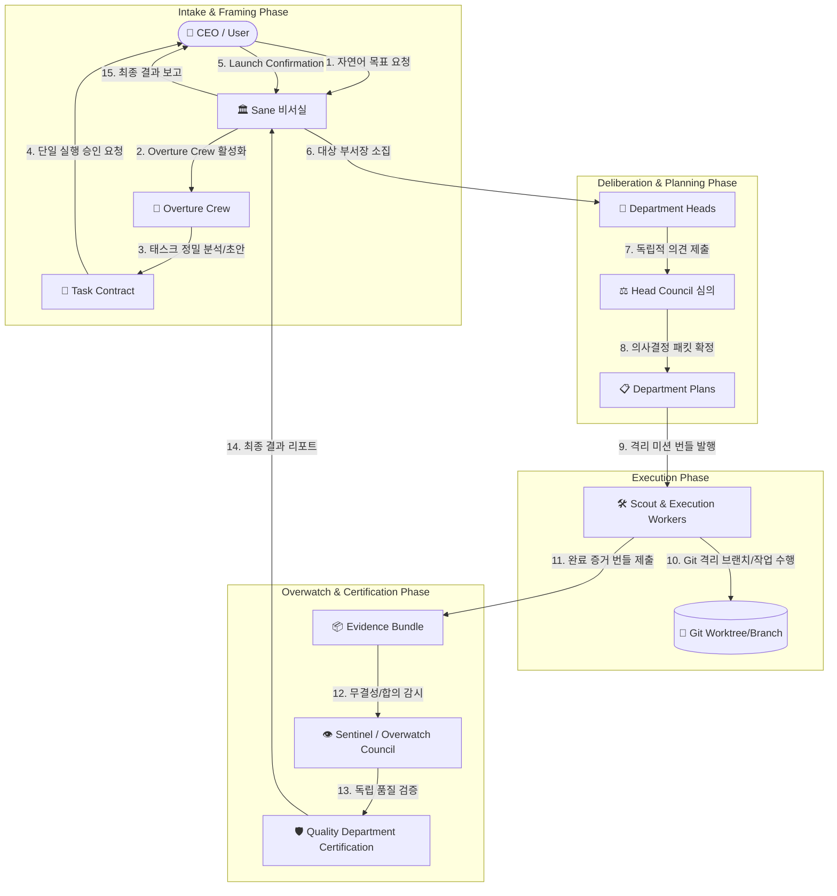

# 계층형 오케스트레이션 구조 (Hierarchical Orchestration)

Maestro는 단순한 단일 에이전트 루프가 아닌, 실제 인간 조직의 역할 분담과 권한 분립을 모델링한 **계층형 다중 에이전트 오케스트레이션 시스템**입니다.

---

## 1. 전체 실행 흐름 다이어그램



---

## 2. 핵심 조직 구성원 및 역할

### 1) CEO (사용자)
* 자연어로 목표(Goal)를 제시하고 최종 검증 결과를 보고받습니다.
* **Single Launch Confirmation**: Overture Crew가 작성한 Task Contract의 불변 내용(Content Hash)에 대해 단 1회의 실행 승인을 부여합니다.
* 예산 초과 또는 금지된 핵심 액션(Critical Action) 발생 시에만 추가 승인을 요청받습니다.

### 2) Sane (비서실장 / Secretary)
* CEO와의 대화를 전담하며 Goal의 라이프사이클을 총괄합니다.
* Goal의 상태 전이(Draft ➔ Active ➔ Completed / Failed)를 조율하되, 직접 코드를 작성하거나 Git을 수정하지 않습니다.

### 3) Overture Crew (초기 접수 및 계약 수립 크루)
목표 접수 시 최소 필요한 역할만 활성화되는 6개 전문 페르소나 풀:
* **Conversation Lead**: CEO의 요구사항 파악 및 대화 주도.
* **Architecture Analyst**: 기존 코드베이스 토폴로지 및 종속성 분석.
* **External Research Scout**: 외부 문서/자료 리서치 (필요 시에만 활성화).
* **Security Evaluator**: 리스크 분석, 보안 경계 및 예산 한도 설정.
* **Design & Mock Specialist**: UI 변경 시 임시 프리뷰/목업 생성.
* **Task Editor**: 단일 버전의 `task.md` (Task Contract) 작성 및 유지.

### 4) 영구 그룹 및 부서 (Permanent Groups & Departments)

부서는 영구적인 지식과 페르소나를 가지며, 필요할 때만 깨어납니다(Wake-on-Demand).

```text
Product Group
  ├── Product Department (제품 기획/요구사항)
  └── Design Department (UI/UX 디자인)
Tech Group
  ├── Engineering Department (소프트웨어 개발)
  ├── Security Department (보안 감사)
  └── Infrastructure Department (인프라 및 환경)
Intelligence Group
  ├── Research Department (연구/리서치)
  └── Data & Analysis Department (데이터 분석)
Assurance Group
  ├── Quality Department (품질 보증 및 독립 인증)
  └── Safety & Compliance Department (안전 및 컴플라이언스)
Operations Group
  └── Operations Department (운영 및 장애 대응)
```

---

## 3. 심의 및 실행 매커니즘

### 1) Head Council (부서장 의회) & Sealed Submission
* 서로 다른 부서장들이 상대방의 의견에 편향(Bias)되지 않도록, **봉인 제출(Sealed Submission)** 방식을 채택합니다.
* 각 부서장은 독립적으로 의견서(Brief)를 작성하여 해시 스냅샷으로 봉인한 뒤, 모든 부서장의 제출이 완료되면 일괄 공개(Reveal)하여 토론을 진행합니다.
* 2라운드 연속 새로운 이견이 없으면 수렴된 것으로 판단하고 최종 **Department Plan**을 승인합니다.

### 2) Scout & Execution Workers
* 부서장은 Prime Agent의 서브에이전트 계층을 통해 구체적인 작업을 수행할 Worker를 스폰합니다.
* Worker는 **최소 권한의 미션 번들(Mission Bundle)**을 부여받고, 독립된 Git Worktree/Branch에서만 작업합니다.
* 작업 완료 시 작업 내용과 테스트 결과를 담은 **Evidence Bundle(증거 번들)**을 생성합니다.

---

## 4. 독립적 감시 및 인증 (Overwatch & Certification)

* **권한 분립 원칙**: 작업자나 부서장은 자신의 작업 성공 여부를 스스로 승인할 수 없습니다.
* **Sentinel**: 모든 이벤트, 증거 해시, 명령 실행 로그를 실시간으로 모니터링하여 가짜 합의(Collusion)나 증거 없는 주장을 탐지합니다.
* **Overwatch Council**: 모호하거나 의심스러운 결과에 대해 독립적인 심의 라운드를 진행합니다.
* **Quality Certification**: Quality 부서가 최종 Evidence Bundle의 재현 가능성을 독립 검증한 후, `certified` 인증서를 발행해야만 Sane이 CEO에게 최종 성공 보고를 전달합니다.
