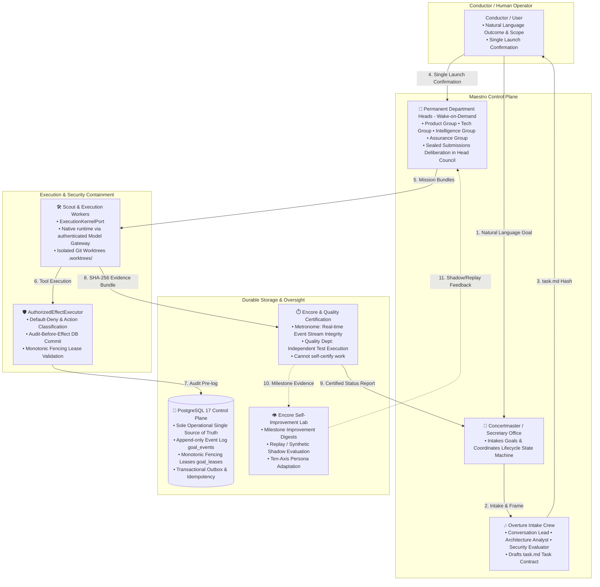

# 01. System Overview

## 1. Architectural Philosophy

Maestro is designed to solve the fundamental unreliability, memory drift, and authority leakage inherent in single-loop agent systems. Rather than relying on a monolithic prompt-loop, Maestro implements an **enterprise organizational model** with strict **separation of powers**, **durable persistence**, and **fail-closed authority gates**.

---

## 2. Core Design Principles

1. **Durable Truth First**: PostgreSQL 17 is the single source of truth for all domain aggregates, events, and transactional outboxes. In-memory states are non-canonical projections.
2. **Separation of Powers**: Executing agents (Workers/Heads) are strictly prohibited from certifying their own work. Verification is handled independently by Quality and Encore (Metronome & Encore Council).
3. **Fail-Closed & Default-Deny Security**: All tool calls and side effects must pass through `AuthorizedEffectExecutor`. Any unclassified, unauthorized, or out-of-scope effect is denied immediately.
4. **Content-Addressed Auditability**: All inputs, plans, briefs, and deliverables are hashed using SHA-256 canonical serialization (`Sealed Submission`), ensuring cryptographically immutable record lineage.
5. **Native Runtime Ownership**: Maestro owns the provider-neutral agent runtime, model gateway boundary, conversation lifecycle, and authority checks. The worker path uses the native execution-kernel over the authenticated Model Gateway; Ensemble Router selection is not implemented.
6. **Evidence-Driven Self-Improvement (Shadow-First Evolution)**: Encore curates execution evidence into compact Improvement Digests to optimize persona axes, role guidance, and routing templates in replay/synthetic shadow runs—without permitting autonomous changes to security authority or safety boundaries.

---

## 3. Native Agent Runtime and Provider Gateway

Maestro keeps model I/O, agent behavior, and durable authority in separate boundaries:

| Responsibility Area | Native runtime / gateway | Maestro Control Plane (`apps/control-plane`) |
| :--- | :--- | :--- |
| **Model & Conversation Management** | `packages/agent-runtime`, provider plugins, authenticated `apps/model-gateway` | Conversation/Goal lifecycle, model policy, project membership, budget ceilings |
| **Worker execution** | `ExecutionKernelPort`; native Model Gateway transport (Ensemble Router selection is not implemented) | Worker admission, authority checks, leases, audit pre-logging |
| **Persistence & Truth** | Provider/session process state is non-canonical | PostgreSQL 17 domain event log, durable conversations, turns, bindings, and leases |
| **Oversight & Quality** | Normalized model/tool observations | Metronome integrity validation, Quality certification, Conductor reporting |

The native runtime owns conversation and worker execution. Provider credentials remain gateway-owned and never enter Control Plane state, prompts, evidence, or logs. The production tool registry is currently empty by design: native workers are read-only text generation until the product-approved host-tool contract is implemented and registered.

---

### Ensemble Router boundary

The current code implements the routing artifacts, not automatic model selection. A/D/E domain contracts, B provider-facts domain and wire schema, C operational-overlay domain and wire schema with a pure Goal snapshot helper, four pressure-band domain and wire schemas, and the human-owned empty `config/model_map.json` baseline are present. Persistence migration [`0072_ensemble_router_artifacts.sql`](../../packages/persistence/migrations/0072_ensemble_router_artifacts.sql) and [`ensemble-router-artifacts.ts`](../../packages/persistence/src/ensemble-router-artifacts.ts) provide durable C overlay/Goal snapshot and append-only routing-evidence storage. Router selection, fixed-model pin migration, host-tool writes/effects, and live acceptance are not present. Native admission therefore still receives one exact `modelPolicy` identity, with `MAESTRO_NATIVE_MODEL` retained as an explicit fixed-model pin/routing-off input where required.

## 4. Repository Layout Overview

Maestro is structured as an **npm workspace monorepo**:

* **`apps/control-plane`**: Fastify 5 REST & Server-Sent Events (SSE) server for durable commands and real-time state streaming.
* **`apps/cli`**: Authenticated command-line client for the implemented Control Plane API; unsupported surfaces fail rather than being simulated.
* **`apps/secretary`**: Electron + React desktop client for the Control Plane (Concertmaster Office).
* **`apps/discord`** (Discord Daemon): Independent out-of-band Discord daemon for incident detection and system health probes.
* **`apps/device-agent`**: Separately running mTLS device protocol process for enrolled, grant-scoped local operations.
* **`apps/device-agent`**: Separately running mTLS device protocol process for enrolled, grant-scoped local operations.
* **`packages/domain`**: Pure TypeScript domain aggregates (Goal, TaskContract, HeadCouncil, DepartmentPlan).
* **`packages/contracts`**: Shared Zod schemas, HTTP REST contracts, and SSE event payloads.
* **`packages/persistence`**: PostgreSQL 17 schema definitions, `pg` queries, and migration files.
* **`packages/authority`**: Authorization engine, action classification matrix, and `AuthorizedEffectExecutor`.
* **`packages/evidence`**: SHA-256 evidence bundle generator and cryptographic verification.
* **`packages/agent-runtime`**: Maestro-owned provider-neutral model/tool/child-agent runtime.
* **`packages/environment-adapter`**: Bounded environment and browser adapters.
* **`packages/device-agent`**: Device grants, signed envelopes, fencing, and command protocol support.
* **`packages/environment-adapter`**: Bounded environment and browser adapters.
* **`packages/device-agent`**: Device grants, signed envelopes, fencing, and command protocol support.
* **`apps/model-gateway`**: Authenticated provider process that owns API keys and managed Codex login state.
* **Native execution kernel**: Routes every root and child admission through the authenticated Model Gateway with explicit grants and durable identity.
* **`packages/git-adapter`**: Isolated Git worktree manager, branch executor, and diff collector.
* **`packages/api-client`**: Type-safe HTTP and SSE client SDK.
