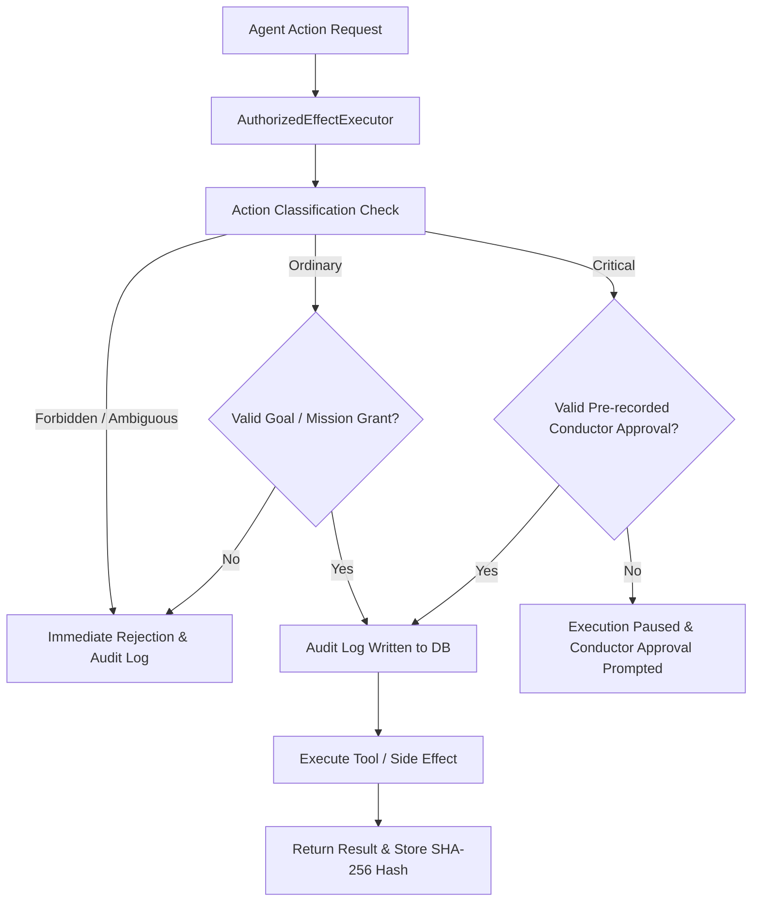
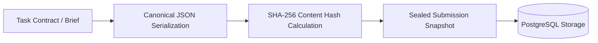

# 04. Security & Authority Model

Maestro enforces **Default-Deny** and **Least Privilege** policies across all execution layers, ensuring autonomous agents cannot perform destructive side effects or bypass authorization limits.

---

## 1. Action Classification Matrix

All system actions are categorized into four explicit security levels (`packages/authority/src/authority.ts`):

| Classification | Action Types | Default Security Policy |
| :--- | :--- | :--- |
| **`ordinary`** | `project.file.edit`, `project.test.run`, `git.local.branch.create`, `git.local.branch.advance`, `git.local.commit`, `git.local.revision.read`, `git.local.worktree.create`, `git.local.worktree.remove`, `browser.navigate`, `browser.click`, `browser.fill`, `browser.get_text`, `browser.screenshot` | Allowed only with an active, matching grant and Mission Bundle. The classification does not register or enable a production tool by itself. |
| **`critical`** | `git.remote.push`, `deployment.release`, `external.send`, `permanent.delete`, `payment.spend`, `authority.change`, `external.connect` | Requires explicit, pre-recorded Conductor / Authority confirmation. |
| **`forbidden`** | `system.policy.bypass`, unauthorized privilege escalation | Permanently blocked. Raises a security audit violation immediately. |
| **`ambiguous`** | Unrecognized or unclassified action strings | Default-denied. Requires explicit classification review before execution. |

---

## 2. The `AuthorizedEffectExecutor` Gateway

All side effects (file modifications, shell commands, network requests) must pass through the `AuthorizedEffectExecutor` gateway:

### Non-negotiable Security Rules
1. **Audit-Before-Effect**: An audit intent record MUST be committed to PostgreSQL *before* the tool or side effect is executed.
2. **Goal & Lease Context Verification**: Requests must present matching `goalId`, `actorId`, and active monotonic fencing tokens. Expired tokens result in immediate rejection.
3. **No Direct System Calls**: Tool adapters (Git, shell, containers) cannot invoke system primitives directly without passing through `AuthorizedEffectExecutor`.

### Required authority context and capability scope

Every effect request is bound to `commandId`, `projectId`, `actorId`, `goalId`, exact `target`, `policyVersion`, `budgetEffectCents`, and the current `controlEpoch`. A matching grant or exact critical approval must cover every field; changing even the target or budget creates a different request.

A Mission Bundle separately constrains the worker's approved models, skills, tools, paths, environment, authority actions, external/data boundaries, retry limits, worker/child ceilings, and time/budget limits. Installed capability is not assigned capability. The host validates these fields before provider admission and again before any effect.

The production Control Plane currently composes an empty native `ToolRegistry`; unregistered model tools are rejected. The Git adapter is an explicit authority-backed Control Plane service, not a hidden worker callback. The generic critical-action route has no default effect adapter and fails closed rather than claiming success.

---

## 3. Sealed Submissions & Cryptographic Integrity

To prevent collusion, retroactive goal edits, or hallucinations, Maestro employs a **Sealed Submission Protocol**:

* **Canonical JSON Standardization**: Keys are sorted and whitespace is normalized to guarantee consistent SHA-256 hashes across different language runtimes.
* **Immutable Snapshot Binding**: Deliberation briefs, Task Contracts, and Quality certifications bind to `snapshot_hash`. Any modification invalidates downstream execution.
* **Prototype Pollution Guard**: Input parsing strictly rejects dangerous key strings (`__proto__`, `constructor`, `prototype`) with an `InvalidSealedSubmissionSnapshotError`.

## 4. Project access provisioning

Project access changes use `POST /v1/admin/project-access`. The route authenticates a bearer credential and checks the requester against the explicit `MAESTRO_OPERATOR_PROVISIONING_ADMIN_ID` configuration. Without that configuration, the route is unavailable. Ordinary project membership checks do not authorize this global operation.

The target must be an active local operator. Requested role IDs are validated against standing immutable `permanent_roles`; arbitrary capabilities and wildcard values are rejected. Membership and every requested role are inserted in one transaction, so failed role validation cannot leave partial access.
