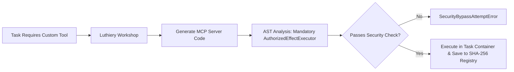

# 05. Roadmap & Phase Status

Maestro follows a strict phased milestone roadmap. Code completion alone does not constitute phase acceptance—each phase requires empirical proof passing real PostgreSQL integration suites and operational usability exit gates.

---

## 1. Multi-Phase Roadmap Matrix

| Phase | Title | Code Status | Verification & Operational Exit Gate |
| :--- | :--- | :---: | :--- |
| **Phase 1** | Technical Foundation & Durable Control Plane | **Code Complete** | Fastify REST/SSE API, PostgreSQL 17 event sourcing, monotonic fencing leases, native runtime/provider-gateway boundary, and legacy worker bridge isolation. |
| **Phase 2** | Concertmaster Office Core & Hierarchical Execution | **Code Complete** | Overture Crew intake flow, Task Contract identity, Head Council sealed deliberation, Department Plans, isolated Git execution. |
| **Phase 3** | Encore, Certification & First Usable Release | **Code Complete** | Metronome live event monitoring, Encore Council adjudication, independent Quality certification, Concertmaster report generation, CLI/App API parity. |
| **Phase 4** | Isolated Environments, Devices & Discord Incidents | **Code Complete** *(Self-verified)* | Declarative container recipes, Playwright browser isolation, enrolled device authorization, Discord out-of-band incident detection. |
| **Phase 5** | Concurrent Goals & Portfolio Control | Planned | Multi-goal isolation, budget/compute contention scheduling, Portfolio Council priority management. |
| **Phase 6** | Encore Learning & 10-Axis Adaptation | **Step 1 accepted** *(immutable digest)* | Step 1: project-private, source-bound Improvement Digests. Steps 2+ (replay, mutation, rollout, adaptation, promotion) remain deferred. |
| **Phase 7** | Full Concertmaster Office & Radial Control Surface | Planned | Next.js 16 / React 19 web application, `@xyflow/react` radial portfolio visualization, real-time SSE interaction. |
| **Phase 8** | Full-System Hardening & Release Certification | Planned | Adversarial stress testing, security penetration audit, recovery verification, release candidate freeze. |

### Native agent backend migration — current boundary

The Maestro native runtime and authenticated model gateway own conversation and worker execution. Durable ChatGPT account-login recovery is integrated, including fenced status/cancel operations and metadata-only persistence. Native execution admissions now carry host context, immutable grants, exact provider-qualified model policy, account binding, and idempotency, and every native call site (Worker, Head, semantic review, Encore reviewers, team-lead helpers) durably records selected-vs-actual model and gateway-binding identity in an append-only `native_execution_bindings` table. A full single-worker real-PostgreSQL rerun on a clean disposable container passed **155/155 files, 1051/1051 tests, 0 failed** (2026-09-08), including kill/restart recovery, fencing, authority denial, and the loopback Model Gateway HTTP acceptance test. A full Control Plane + PostgreSQL + real Model Gateway Worker acceptance scenario now passes end to end (`apps/control-plane/src/native-worker-acceptance.integration.test.ts`), which also found and fixed a real wire-schema defect (`limitsFor()` sent an unclamped per-call timeout for any Mission Bundle time ceiling over 10 minutes). One Phase 1 item stays open: production native host-tool registration/enforcement through the real gateway path -- `ToolRegistry` is fail-closed and correctly implemented, but no Maestro-callback tool is registered in production yet, and the OpenAI Codex adapter runs every session read-only, so a native Worker today is text-generation only.

The CLI TUI uses `@earendil-works/pi-tui` terminal primitives. This is a presentation dependency with no provider or execution authority.

### TUI Phase Boundary

The TUI is an operator view and command client, not a second control plane. It reads authoritative state and sends commands only through `@maestro/api-client` and authenticated Control Plane routes. It must not connect to PostgreSQL, the Model Gateway, provider APIs, or device transports directly. Phase acceptance requires API/TUI parity for the same real Goal, SSE cursor-safe reconnect, explicit loading/error/stale states, and no credential, prompt, raw gateway-binding, or secret-bearing output in terminal state or logs. Terminal input never bypasses leases, fencing, capability grants, approvals, or idempotency.

### Phase 6 Step 1 — Accepted Boundary

Phase 6 Step 1 is accepted as an immutable, project-private Improvement Digest slice. Each digest is source-bound to a Goal and its project, protected by lease authority and membership-scoped reads, and validated against its canonical content hash. This slice does **not** perform automatic mutation, replay, rollout, persona adaptation, or cross-project promotion. Phase 6 Steps 2+ remain deferred until separately planned, implemented, reviewed, and accepted.

---

## 2. Operational Usability Audit Notice

> [!IMPORTANT]
> **Operational Usability Gate Disclaimer:**  
> While domain and persistence unit test suites for Phases 1–4 are green, an independent operational usability audit (`plan/operations/task_plan.md`) established that Phase 1–3 control plane features remain gated behind operational usability requirements (e.g., end-to-end service API execution pathways, real effect executor wiring for Git, and continuous Metronome observation). The native conversation and worker paths are available; remaining acceptance depends on real gateway-process, restart, and recovery evidence. Phase 4 device controls similarly await live device agent protocol wiring. Implementation of these operational usability tracks is tracked under the **Phase 5 Remediation Plan**.

---

## 3. Post-Phase 8 Extensions

### 1) Luthiery (Dynamic MCP Workshop)

**Luthiery** (Phase 9 candidate) enables agents to generate, audit, run, and reuse specialized **Model Context Protocol (MCP)** servers dynamically during task execution without compromising core safety boundaries ([`plan/post-phase8-ideas.md`](file:///home/ubuntu/projects/ms/plan/post-phase8-ideas.md)).

#### Core Luthiery Principles
1. **Organizational Separation**: Placed under the **Operations / Infrastructure Group**. Strictly separated from Encore to avoid self-auditing conflicts of interest.
2. **Container Sandbox Binding**: Dynamic MCP server processes run inside Phase 4 containers, bound directly to the Goal's fencing token lease (`SIGTERM` cleanup on expiry).
3. **AST Static Enforcement**: Generated handler code must explicitly include `AuthorizedEffectExecutor.execute()` wrappers, failing static analysis otherwise.
4. **Content-Addressed Reuse**: Certified MCP server binaries are indexed in `packages/evidence` using SHA-256 hashes for instant zero-latency reuse in future goals.

---

### 2) Autonomous Treasury & Real Capital Wallet

**Autonomous Treasury** (Phase 9/10 candidate) embeds a durable, system-managed wallet into Maestro, granting the orchestration system real financial capability to autonomously pay for APIs, cloud computing resources, and Web3 smart contract interactions using pre-funded capital ([`plan/post-phase8-ideas.md`](file:///home/ubuntu/projects/ms/plan/post-phase8-ideas.md)).

#### Core Treasury Principles
1. **Pre-funded Capital Model**: Orchestration operates on user-funded/pre-charged capital (Web3 crypto assets & traditional fiat payment rails like Stripe/Plaid).
2. **Treasury Department Ownership**: Managed under the **Operations / Finance Group (Treasury Department)**, allocating spend ceilings per goal during Head Council planning.
3. **Autonomous Execution with Optional 2-Step Gate**: Standard in-budget spend executes autonomously via `payment.spend` actions; high-value payments can enforce an optional 2-step Conductor approval threshold.
4. **Audit-Before-Spend & Metronome Monitoring**: Transaction intents and double-entry receipts are immutably logged in PostgreSQL before network dispatch, monitored continuously by **Metronome** for unusual spend velocity.
