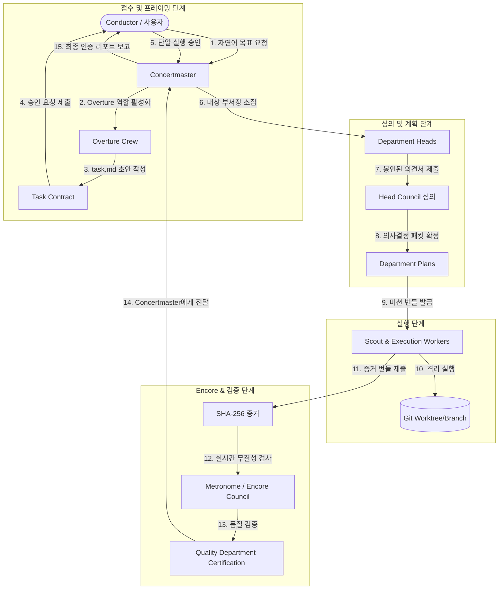

# 02. 계층형 오케스트레이션 (Hierarchical Orchestration)

Maestro는 전문화된 페르소나, 영구 부서, 접수 크루 및 독립 감시 의회에 책임을 분담하여 인간 조직 구조를 모델링합니다.

---

## 1. 전체 오케스트레이션 흐름 (End-to-End Flow)



---

## 2. 핵심 조직 구성원 및 역할

### 1) Conductor (사용자 / 지휘자)
* 자연어로 목표(Goal)를 제시하고 최종 검증 결과를 보고받습니다.
* **단일 실행 승인 (Single Launch Confirmation)**: Overture Crew가 작성한 Task Contract의 불변 내용(Content Hash)에 대해 단 1회의 실행 승인을 부여합니다.
* 예산 초과 또는 `critical` 액션 발생 시에만 추가 승인을 요청받습니다.

### 2) Concertmaster (비서실장 / 악장)
* 전체 Goal의 라이프사이클을 총괄하며 Conductor와의 대화를 전담합니다.
* 직접 코드를 작성하거나 Git을 수정하지 않고 상태 전이(`draft` ➔ `active` ➔ `completed` / `failed`)를 조율합니다.

### 3) Overture Crew (초기 접수 및 계약 수립 크루)
목표 생성 시 6개 전문 페르소나 후보 풀에서 최소 필요 역할만 활성화됩니다:
* **Conversation Lead**: Conductor의 요구사항 파악 및 대화 주도.
* **Architecture Analyst**: 기존 코드베이스 토폴로지 및 종속성 분석.
* **External Research Scout**: 외부 문서/자료 리서치 (필요 시 활성화).
* **Security Evaluator**: 리스크 분석, 보안 경계 및 예산 한도 설정.
* **Design & Mock Specialist**: UI 변경 시 임시 프리뷰/목업 생성.
* **Task Editor**: 단일 버전의 `task.md` (Task Contract) 작성 및 유지.

---

## 3. 영구 그룹 및 부서 (Permanent Groups & Departments)

부서는 영구적인 지식과 정체성을 가지며, **Wake-on-Demand** 모델로 작동합니다. Sleeping 부서는 CPU/토큰 자원을 소비하지 않으며 활성 맥락을 수신하지 않습니다.

```text
Product Group
  ├── Product Department (제품 기획/요구사항)
  └── Design Department (UI/UX 디자인)
Tech Group
  ├── Engineering Department (소프트웨어 개발)
  ├── Security Department (보안 감사)
  └── Infrastructure Department (인프라 및 환경)
Intelligence Group
  ├── Research Department (연구/리서치)
  └── Data & Analysis Department (데이터 분석)
Assurance Group
  ├── Quality Department (품질 보증 및 독립 인증)
  └── Safety & Compliance Department (안전 및 컴플라이언스)
Operations Group
  └── Operations Department (운영 및 장애 대응)
```

---

## 4. Head Council & 봉인 제출 (Sealed Submissions)

기획 단계에서 편향과 집단 사고를 방지하기 위해 부서장들은 **봉인 제출 프로토콜(Sealed Submission Protocol)**을 채택합니다:

1. **독립 의견서**: 각 활성화된 부서장은 Goal 해석, 담당 기여, 종속성, 리스크, 비용 및 시간 추정치를 담은 독립 의견서를 작성합니다.
2. **암호화 봉인**: 의견서는 해시화(`snapshot_hash`)되어 PostgreSQL에 동결 저장됩니다.
3. **일괄 공개 및 토론**: 모든 부서장이 제출을 완료하면 일괄 공개되어 최대 2라운드 동안 토론이 진행됩니다.
4. **수렴 검증**: 2라운드 연속 새로운 이견이 없으면 수렴된 것으로 판단하고 최종 **Department Plan**을 승인합니다.

---

## 5. Scout & Execution Workers

* 부서장은 Prime Agent 서브에이전트 API를 통해 작업자(Worker)를 스폰합니다.
* 작업자는 최소 권한 원칙의 **Mission Bundle** 하에서 작동합니다.
* 모든 코드 수정은 격리된 Git 워크트리(`.worktrees/`) 내에서 일어납니다.
* 작업 완료 시 테스트 로그, 디프, 아티팩트 SHA-256 해시를 포함한 **Evidence Bundle**을 생성합니다.

---

## 6. Encore & 독립 인증 (Independent Certification)

* **검증 권력 분립**: 작업자나 부서장은 자신의 작업 결과를 스스로 승인할 수 없습니다.
* **Metronome**: 도메인 이벤트 및 아웃박스 로그를 실시간 모니터링하여 절차 위반, 범위를 벗어난 작업, 가짜 합의를 탐지합니다.
* **Encore Council**: 모호하거나 의심스러운 결과, 부서 간 이견에 대해 독립 심의를 진행합니다.
* **Quality Certification**: Quality 부서가 최종 Evidence Bundle의 재현 가능성을 독립 검증한 후, `certified` 인증서를 발행해야만 Concertmaster가 Conductor에게 최종 성공 보고를 전달합니다.
