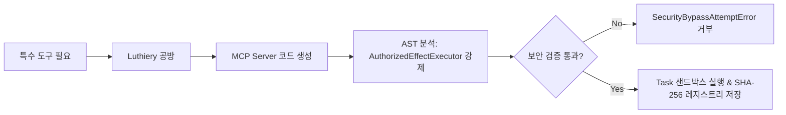

# 05. 단계별 로드맵 및 구현 현황 (Roadmap & Phase Status)

Maestro는 각 단계의 검증 증거가 완료되어야 다음 단계로 진입하는 엄격한 단계별(Phased) 릴리즈 모델을 따릅니다.

---

## 1. 단계별 로드맵 전체 현황 (Roadmap Matrix)

| 단계 | 명칭 | 코드 상태 | 검증 기준 및 운영 승인 게이트 |
| :--- | :--- | :---: | :--- |
| **Phase 1** | Technical Foundation & Durable Control Plane | **코드 완료** | Fastify REST/SSE API, PostgreSQL 17 이벤트 소싱, 단조 리스 펜싱 토큰, Prime어댑터 격리 |
| **Phase 2** | Concertmaster Office Core & Hierarchical Execution | **코드 완료** | Overture Crew 접수, Task Contract 불변성, Head Council 봉인 심의, Department Plans, Git 격리 실행 |
| **Phase 3** | Encore, Certification & First Usable Release | **코드 완료** | Metronome 실시간 이벤트 모니터링, Encore Council 심의, Quality 독립 인증, Concertmaster 리포트 생성, CLI/App Parity |
| **Phase 4** | Isolated Environments, Devices & Discord Incidents | **코드 완료** *(자체검증)* | 컨테이너/샌드박스 레시피, Playwright 브라우저 격리, 등록 디바이스 인가, Discord 아웃오브밴드 인시던트 감지 |
| **Phase 5** | Concurrent Goals & Portfolio Control | 예정 | 다중 Goal 동시 실행 격리, 예산/컴퓨팅 경합 시 포트폴리오 우선순위 제어 |
| **Phase 6** | Encore Learning & 10-Axis Adaptation | 예정 | 오프라인 리플레이 랩, 10개 성격 축(Persona Axes) 튜닝, 가상 평가, 지식 큐레이션 |
| **Phase 7** | Full Concertmaster Office & Radial Control Surface | 예정 | Next.js 16 / React 19 웹 UI(Concertmaster Office), `@xyflow/react` 방사형 포트폴리오 대시보드 |
| **Phase 8** | Full-System Hardening & Release Certification | 예정 | 적대적 장애 주입, 보안 침투 감사, 지속 부하 검증 및 릴리즈 프리즈 |

---

## 2. 운영 사용성 감사 공지 (Operational Usability Audit)

> [!IMPORTANT]
> **운영 사용성 게이트 공지:**  
> Phase 1–4의 도메인/영속성 단위 테스트는 GREEN 상태이지만, 독립 감사 결과 Phase 1–3 제어 평면 기능은 실운영 사용성 요구사항(엔드투엔드 서비스 API 실행 경로, Git 실효 어댑터 연결, 상시 Metronome 관찰)이 완료되어야 승인됩니다. Phase 4 디바이스 제어 역시 실제 라이브 기기 에이전트 프로토콜 연결을 대기 중입니다. 이 수정 계획은 **Phase 5 Remediation Plan** 하에서 진행됩니다.

---

## 3. Post-Phase 8 향후 확장 기능

### 1) Luthiery (동적 MCP 공방)

**Luthiery**(Phase 9 후보)는 작업 실행 중 필요한 전용 **Model Context Protocol (MCP)** 서버 및 도구를 런타임에 안전하게 생성, 감사, 실행, 재사용할 수 있는 공방 모듈입니다 ([`plan/post-phase8-ideas.md`](file:///home/ubuntu/projects/ms/plan/post-phase8-ideas.md)).

#### Luthiery 핵심 원칙
1. **조직 분리**: **Operations / Infrastructure Group** 소속으로 배치하여 Encore의 자가 감사 이해상충을 방지.
2. **샌드박스 프로세스 바인딩**: 동적 MCP 데몬 프로세스 PID를 Goal 펜싱 토큰 리스에 바인딩 (만료 시 `SIGTERM` 자동 정제).
3. **AST 정적 분석 강제**: 생성된 모든 도구 핸들러 코드는 반드시 `AuthorizedEffectExecutor.execute()` 호출을 포함해야 함.
4. **콘텐츠 주소 재사용**: 검증된 MCP 도구 바이너리는 SHA-256 해시로 저장되어 향후 동일 태스크에서 즉시 재사용.

---

### 2) Autonomous Treasury & Real Capital Wallet (자율 재무부 지갑)

**Autonomous Treasury**(Phase 9/10 후보)는 Maestro 시스템에 영속적인 자율 지갑을 내장하여, 외부 API, 클라우드 컴퓨팅 자원, Web3 스마트 컨트랙트 결제를 직접 집행할 수 있는 자산 자율성을 부여합니다 ([`plan/post-phase8-ideas.md`](file:///home/ubuntu/projects/ms/plan/post-phase8-ideas.md)).

#### Treasury 핵심 원칙
1. **사용자 충전식 예치금 모델**: Conductor(사용자)가 미리 충전한 예치금(Web3 암호화폐 USDC/ETH/Solana 및 Stripe/Plaid 전통 금융 결제) 기반 작동.
2. **재무부(Treasury Department) 소속**: **Operations / Finance Group (Treasury Department)** 관할 하에 Head Council 기획 시 태스크별 Spending Ceiling 할당.
3. **자율 집행 및 옵션 2단계 승인**: 승인 예산 범위 내 지출은 `payment.spend` 액션으로 자율 집행되며, 고액 지출 시 Conductor 사전 승인 2-step 락 설정 가능.
4. **Audit-Before-Spend & Metronome 실시간 감시**: 결제 전 트랜잭션 의도 및 복식부기 영수증을 PostgreSQL에 먼저 기록하며, **Metronome**이 이상 지출 속도를 실시간 모니터링.
