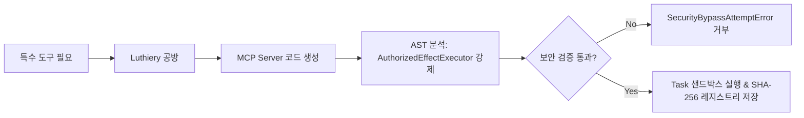

# 05. 단계별 로드맵 및 구현 현황 (Roadmap & Phase Status)

Maestro는 각 단계의 검증 증거가 완료되어야 다음 단계로 진입하는 엄격한 단계별(Phased) 릴리즈 모델을 따릅니다.

---

## 1. 단계별 로드맵 전체 현황 (Roadmap Matrix)

| 단계 | 명칭 | 코드 상태 | 검증 기준 및 운영 승인 게이트 |
| :--- | :--- | :---: | :--- |
| **Phase 1** | Technical Foundation & Durable Control Plane | **구현 게이트 완료; host-tool 제품 게이트 대기** | G1–G6 구현 증거가 완료되었으며 실제 PostgreSQL TUI/API parity와 SSE cursor-safe reconnect를 포함함. Production host-tool 등록/집행은 Phase 2 IPython 계약으로 남아 있으며 코드 증거만으로 최종 제품 승인을 주장하지 않음 |
| **Phase 2** | Concertmaster Office Core & Hierarchical Execution | **Plan 2 S6 검증 완료; 문서 동기화 완료; live acceptance 대기** | Plan 2 S6에서 persistent IPython 로컬 host-tool, 4단계 승인 계층, full-access 모드 및 recovery 증거를 확보함. Live acceptance는 사용자가 실행하는 게이트로 남으며, 과거 code-level 완료 표시는 제품 승인을 뜻하지 않음 |
| **Phase 3** | Encore, Certification & First Usable Release | **릴리스 게이트 대기; host-tool 의존성 명시** | Metronome, Encore, 인증, 보고서 및 native process 증거는 있음. TUI parity/reconnect 증거는 확보되었으며 Phase 2 host-tool 동작과 release-level recovery 증거가 통과하기 전까지 first usable release는 승인하지 않음 |
| **Phase 4** | Isolated Environments, Devices & Discord Incidents | **구현 완료; live acceptance 건너뜀 (미완료)** | Plan 4 S1–S4 구현 증거가 `2631ed4`까지 main에 병합됨. Goal-scoped gate, restart 중복 제거와 [`test/phase4-scenario/RUNBOOK.md`](../../test/phase4-scenario/RUNBOOK.md)가 포함됨. 사용자 소유 live handoff는 건너뛰었으므로 live activation, outage/restart, provider/device effect 또는 certification 증거를 주장하지 않음 |
| **Phase 5** | Concurrent Goals & Portfolio Control | **활성 remediation/capacity 작업** | 프로젝트별 worker cap은 구현됨. Resource inventory, demand reservation 및 portfolio scheduling은 향후 작업 |
| **Phase 6** | Encore Learning & 10-Axis Adaptation | **Step 1 승인 완료** *(불변 다이제스트)* | Step 1: 프로젝트 전용·출처 바인딩 Improvement Digest. Step 2 이후(리플레이, 변경, 롤아웃, 적응, 프로젝트 간 승격)는 보류 |
| **Phase 7** | Full Concertmaster Office & Radial Control Surface | 예정 — Electron 방향 | Electron + Vite + React 19 데스크톱 앱, typed API/SSE 상호작용 및 그래프 slice 구현 시 `@xyflow/react` 방사형 포트폴리오 시각화. 현재 목표는 Next.js/PWA가 아님 |
| **Phase 8** | Full-System Hardening & Release Certification | 예정 | 적대적 장애 주입, 보안 침투 감사, 지속 부하 검증 및 릴리즈 프리즈 |

### 네이티브 에이전트 백엔드 마이그레이션 — 현재 경계

Maestro 네이티브 런타임과 인증된 model gateway가 대화와 워커 실행을 모두 담당합니다. ChatGPT account-login recovery도 내구성 상태, fenced status/cancel 작업 및 metadata-only 저장을 포함하여 통합되었습니다. 네이티브 admission은 host context, immutable grant, 정확한 provider-qualified model policy, account binding 및 idempotency를 포함하며, 모든 native 호출 지점(Worker, Head, semantic review, Encore reviewer, team-lead helper)이 selected/actual 모델과 gateway binding identity를 append-only `native_execution_bindings` 테이블에 durable하게 기록합니다. 깨끗한 disposable 컨테이너에서 실행한 단일 worker 전체 real-PostgreSQL 재실행이 **162/162 파일, 1066/1066 테스트, 실패 0건**으로 통과했습니다(2026-09-09), kill/restart 복구, fencing, authority denial, loopback Model Gateway HTTP acceptance 테스트, 그리고 실제 Model Gateway를 사용하는 전체 Control Plane + PostgreSQL + Worker acceptance 테스트(`native-worker-acceptance.integration.test.ts`)를 포함합니다. 이 테스트를 만드는 과정에서 실제 wire-schema 결함(`limitsFor()`가 10분을 넘는 모든 Mission Bundle time ceiling에 대해 clamp되지 않은 per-call timeout을 보냄)도 발견해 수정했습니다. 남은 Phase 1 항목은 하나입니다: 실제 gateway 경로를 통한 production native host-tool 등록/집행 -- `ToolRegistry`는 fail-closed로 올바르게 구현되어 있지만 production에는 아직 등록된 Maestro-callback tool이 없고, OpenAI Codex adapter는 모든 세션을 read-only로 실행하므로 현재 native Worker는 텍스트 생성만 가능합니다.

CLI TUI는 `@earendil-works/pi-tui` `0.85.1` 터미널 primitive를 사용합니다. 이는 provider나 실행 권한이 없는 표현 계층 의존성입니다.

### Ensemble Router artifact persistence 경계

A/D/E domain contract, B provider facts, C operational overlay와 순수 Goal snapshot, 4개 pressure band 및 human-owned `model_map` baseline이 구현되었습니다. [`routing-selector.ts`](../../packages/domain/src/routing-selector.ts)가 A↔D weakest-link selection과 B/C hard filter를 구현합니다. [`0072_ensemble_router_artifacts.sql`](../../packages/persistence/migrations/0072_ensemble_router_artifacts.sql)과 [`ensemble-router-artifacts.ts`](../../packages/persistence/src/ensemble-router-artifacts.ts)가 C overlay, 불변 Goal snapshot 및 append-only routing evidence를 저장하며 실제 PostgreSQL gate는 [`ensemble-router-artifacts.integration.test.ts`](../../packages/persistence/src/ensemble-router-artifacts.integration.test.ts)입니다. Production selector/native-admission wiring, fixed-model evidence migration, production host-tool write/effect, live host-tool acceptance 및 TUI SSE reconnect evidence는 남아 있으며 Phase 1은 닫히지 않았고 native admission은 여전히 정확히 하나의 `modelPolicy` identity를 요구합니다.

### TUI 단계 경계

TUI는 두 번째 Control Plane이 아니라 운영자 표시·명령 클라이언트입니다. 권위 있는 상태 조회와 명령 전송은 `@maestro/api-client` 및 인증된 Control Plane route를 통해서만 수행합니다. PostgreSQL, Model Gateway, provider API, device transport에 직접 연결하지 않습니다. 단계 승인에는 동일한 실제 Goal에 대한 API/TUI parity, SSE cursor 보존 재연결, 명시적인 loading/error/stale 상태 표시, terminal state와 로그에 credential·prompt·raw gateway binding·secret-bearing output이 없다는 증거가 필요합니다. 터미널 입력은 lease, fencing, capability grant, approval, idempotency를 우회할 수 없습니다.

### Production IPython host-tool 경계 — 2026-09-09

첫 production host-tool slice는 Phase 2에 속하며 Prime Agent를 다시 도입하지 않고 Prime Agent식 실행 형태를 사용합니다. 하나의 persistent `ipython` surface, 세션 전용 Python 함수, 명시적 프로젝트 skill 저장, 안정적인 권한 계약이 필요한 경우에만 직접 구조화 tool을 사용합니다.

- Phase 2 범위는 프로젝트 파일, 로컬 Git, 테스트, 로컬 shell 명령 및 로컬 환경 변경입니다.
- 기본 세션은 Goal worktree와 선언된 임시 디렉터리로 제한합니다. 사용자는 세션별 full local access를 켜고 Head·Encore 중간 승인을 유지할지 생략할지 선택할 수 있습니다.
- 승인 계층은 단독 실행 → 활성 Department Head → Encore Council → 사용자입니다. 애매한 작업과 Encore 불일치는 사용자에게 상승합니다. 혼합 위험 IPython 블록은 가장 높은 단계를 적용하며 부분 실행하지 않습니다.
- 승인 범위는 1회 실행, 횟수·시간·예산 제한, 세션 기간 중에서 선택합니다. 모든 결정과 효과를 기록하고 사용자는 실행 중 중단할 수 있습니다. `forbidden` 작업은 항상 차단합니다.
- Phase 4는 외부 capability를 하나씩 별도 활성화합니다. Phase 6은 이후 자가개선 경계이며, Phase 9 Luthiery는 미래의 동적 MCP 공방입니다.

### Phase 6 Step 1 — 승인된 경계

Phase 6 Step 1은 불변·프로젝트 전용 Improvement Digest slice로 승인되었습니다. 각 digest는 Goal과 프로젝트에 출처 바인딩되고, lease 권한과 멤버십 범위 조회로 보호되며, canonical content hash로 검증됩니다. 이 slice는 자동 변경, 리플레이, 롤아웃, persona 적응 또는 프로젝트 간 승격을 수행하지 않습니다. Phase 6 Step 2 이후는 별도 계획·구현·리뷰·승인 전까지 보류합니다.

---

## Act별 현황 (2026-09-09)

| Act | 현재 상태 | Ensemble Router / runtime 경계 |
| --- | --- | --- |
| **Act 1 — Foundation** | **구현 게이트 완료; 최종 인증 전** | A/D/E contract, B provider facts, 순수 Goal snapshot을 포함한 C operational overlay, 4개 pressure-band schema 및 human-owned 빈 `model_map` baseline이 있습니다. S1/S2/S3와 G6의 실제 PostgreSQL TUI/API parity, cursor-safe SSE reconnect 및 명시적 failure 증거가 merge·검증되었습니다. Production selector/native-admission wiring, fixed-model evidence migration, host-tool write/effect 및 live acceptance는 남아 있으며 Phase 1은 최종 승인되지 않았습니다. [`roadmap/act-1-foundation/README.md`](../../roadmap/act-1-foundation/README.md) 참조. |
| **Act 2 — Flashmob** | **Act 1 인증까지 차단** | Flashmob production path나 automatic Ensemble Router selection을 구현되었다고 주장하지 않습니다. [`roadmap/act-2-flashmob/README.md`](../../roadmap/act-2-flashmob/README.md) 참조. |
| **Act 3 — Arrangement** | **보류** | 개인화 self-modification은 Act 2 이후이며 routing 또는 model-map 변경을 자동 승격하지 않습니다. [`roadmap/act-3-arrangement/README.md`](../../roadmap/act-3-arrangement/README.md) 참조. |

## 2. 운영 사용성 감사 공지 (Operational Usability Audit)

> [!IMPORTANT]
> **운영 사용성 게이트 공지:**  
> 코드 및 PostgreSQL 증거는 릴리스 승인을 뜻하지 않습니다. Native conversation과 Worker는 실제 Model Gateway/PostgreSQL acceptance 및 restart/fencing 증거를 갖추었습니다. TUI parity/reconnect 증거는 G6를 통해 완료되었습니다. 남은 게이트는 production host-tool 제품 승인·구현과 별도 실행 authenticated device-agent protocol의 독립 review/production 승인입니다(실제 process gate 자체는 구현됨). 상세 상태는 `roadmap/act-1-foundation/active/operations/task_plan.md`에 기록합니다.

---

## 3. Post-Phase 8 향후 확장 기능

### 1) Luthiery (동적 MCP 공방)

**Luthiery**(Phase 9 후보)는 작업 실행 중 필요한 전용 **Model Context Protocol (MCP)** 서버 및 도구를 런타임에 안전하게 생성, 감사, 실행, 재사용할 수 있는 공방 모듈입니다 ([`roadmap/act-1-foundation/phase-09-luthiery.md`](../../roadmap/act-1-foundation/phase-09-luthiery.md)).

#### Luthiery 핵심 원칙
1. **조직 분리**: **Operations / Infrastructure Group** 소속으로 배치하여 Encore의 자가 감사 이해상충을 방지.
2. **샌드박스 프로세스 바인딩**: 동적 MCP 데몬 프로세스 PID를 Goal 펜싱 토큰 리스에 바인딩 (만료 시 `SIGTERM` 자동 정제).
3. **AST 정적 분석 강제**: 생성된 모든 도구 핸들러 코드는 반드시 `AuthorizedEffectExecutor.execute()` 호출을 포함해야 함.
4. **콘텐츠 주소 재사용**: 검증된 MCP 도구 바이너리는 SHA-256 해시로 저장되어 향후 동일 태스크에서 즉시 재사용.

---

### 2) Autonomous Treasury & Real Capital Wallet (자율 재무부 지갑)

**Autonomous Treasury**(Phase 9/10 후보)는 Maestro 시스템에 영속적인 자율 지갑을 내장하여, 외부 API, 클라우드 컴퓨팅 자원, Web3 스마트 컨트랙트 결제를 직접 집행할 수 있는 자산 자율성을 부여합니다 ([`roadmap/act-1-foundation/phase-10-autonomous-treasury.md`](../../roadmap/act-1-foundation/phase-10-autonomous-treasury.md)).

#### Treasury 핵심 원칙
1. **사용자 충전식 예치금 모델**: Conductor(사용자)가 미리 충전한 예치금(Web3 암호화폐 USDC/ETH/Solana 및 Stripe/Plaid 전통 금융 결제) 기반 작동.
2. **재무부(Treasury Department) 소속**: **Operations / Finance Group (Treasury Department)** 관할 하에 Head Council 기획 시 태스크별 Spending Ceiling 할당.
3. **자율 집행 및 옵션 2단계 승인**: 승인 예산 범위 내 지출은 `payment.spend` 액션으로 자율 집행되며, 고액 지출 시 Conductor 사전 승인 2-step 락 설정 가능.
4. **Audit-Before-Spend & Metronome 실시간 감시**: 결제 전 트랜잭션 의도 및 복식부기 영수증을 PostgreSQL에 먼저 기록하며, **Metronome**이 이상 지출 속도를 실시간 모니터링.
