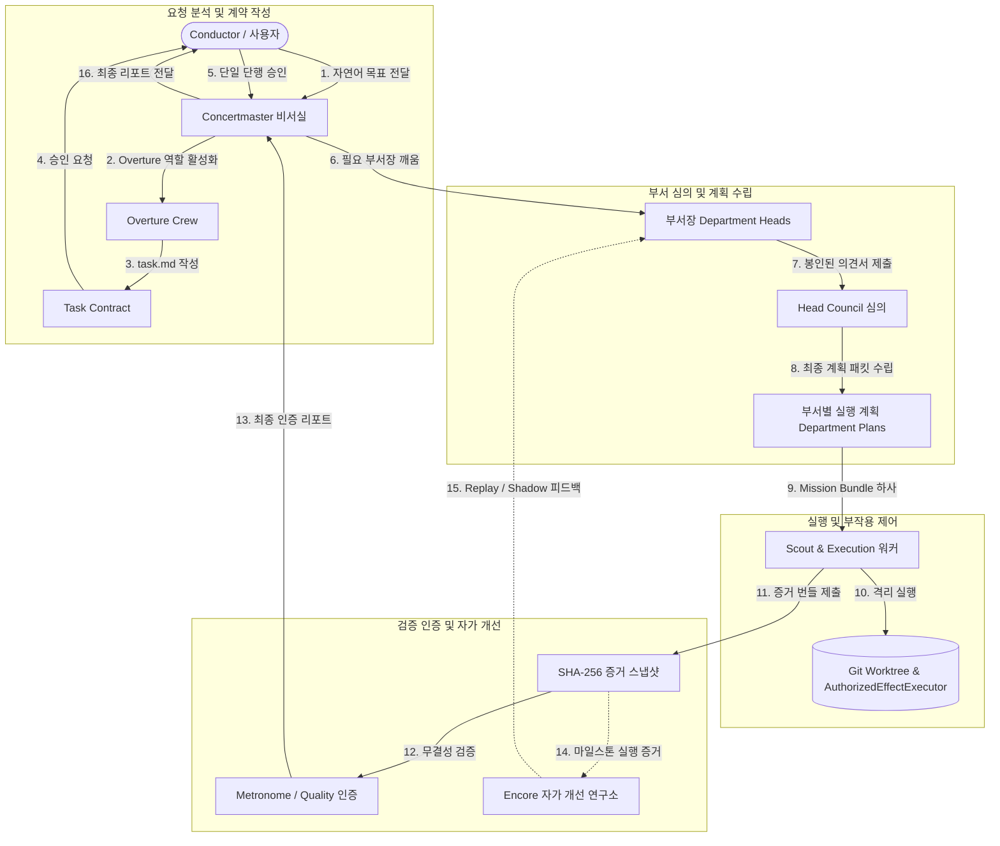

<p align="center">
  <a href="../../README.md">
    
  </a>
</p>

<h3 align="center">
Maestro: 다채로운 작업을 위한 자가 개선 및 내구성 있는 에이전트 오케스트레이션
</h3>
<p align="center">
  <a href="README.md"><b>한국어 (ko)</b></a> &bull;
  <a href="../en/README.md"><b>English (en)</b></a> &bull;
  <a href="01-system-overview.md"><b>아키텍처</b></a> &bull;
  <a href="02-hierarchical-orchestration.md"><b>계층 구조</b></a> &bull;
  <a href="04-security-and-authority-model.md"><b>보안 모델</b></a> &bull;
  <a href="05-roadmap-and-phase-status.md"><b>로드맵</b></a>
</p>

<p align="center">
  
  
  
  
</p>

---

> **언어 선택:** [**한국어 (ko)**](README.md) | [**English (en)**](../en/README.md)

Maestro는 신뢰할 수 있고 장시간 실행되는 다중 에이전트 목표 실행을 위해 설계된 오픈 소스 엔터프라이즈 AI 오케스트레이션 프레임워크입니다. **Prime Agent SDK**를 기반으로 구축된 Maestro는 실제 인간 조직 구조를 모델링하며, 권력 분립, 영구 도메인 부서, 단조 펜싱 리스, 암호화적 감사 가능성을 결합하여 승인되지 않은 부작용(Side Effect)이 발생하지 않도록 보장합니다.

## 핵심 아키텍처 및 4대 기둥 (Core Architecture & Pillars)

Maestro는 네 가지 핵심 아키텍처 보증을 중심으로 구축되었습니다:

- **계층적 조직 구조 및 권력 분립 (Hierarchical Organization & Separation of Powers):**
  - **Concertmaster (비서실)**: Conductor와 함께 자연어 목표를 오케스트레이션합니다.
  - **Overture Crew (6개 후보 페르소나)**: 요구사항을 분석하고 불변의 **Task Contract** (`task.md`)를 작성합니다.
  - **영구 부서장 (Product, Tech, Security, Quality, Operations)**: 필요 시 깨어나(Wake-on-Demand) **봉인 제출(Sealed Submissions)**을 사용하여 심의합니다.
  - **Scout & Execution Workers**: 엄격한 최소 권한 Mission Bundle 하에 격리된 Git worktree 내부에서 작동합니다.
  - **독립 Quality & Encore (Metronome)**: 증거를 검증하고 암호화 인증서를 발급합니다—실행 에이전트는 절대로 *자가 검증(Self-Certify)*할 수 없습니다.

- **Fail-Closed 및 Default-Deny 보안 (Fail-Closed & Default-Deny Security):**
  - 모든 시스템 액션은 엄격하게 분류됩니다 (`ordinary`, `critical`, `forbidden`, `ambiguous`).
  - 모든 도구 실행, 파일 수정 또는 셸 실행은 **`AuthorizedEffectExecutor`**에 의해 게이팅됩니다.
  - 부작용 감사 로그는 도구 실행 *전에* PostgreSQL에 커밋됩니다 (**Audit-Before-Effect**).

- **내구성 있는 제어 평면 (Durable Control Plane):**
  - **PostgreSQL 17**은 Append-Only 도메인 이벤트 소싱(`goal_events`) 및 트랜잭셔널 아웃박스를 사용하는 단일 운영 신뢰 원천입니다.
  - **단조 증가 펜싱 토큰 리스 (`goal_leases`)**: Signed `bigint` 정밀도를 처리하여 고스트 프로세스 및 유령 쓰기를 방지합니다.
  - 공개 `commandId` / `Idempotency-Key` 추적을 통해 모든 변경은 멱등적(Idempotent)입니다.

- **증거 기반 자가 개선 및 적응 (Evidence-Driven Self-Improvement & Adaptation):**
  - **앙코르 학습 및 개선 연구소 (Encore Learning & Improvement Lab)**: 마일스톤 실행 증거를 compact **Improvement Digest**로 큐레이션합니다.
  - **Shadow-First & Replay 평가**: 제안된 프롬프트 가이드, 역할 오버레이, 라우팅 업데이트를 실시간 실행 권한이 없는 격리된 Replay/Synthetic Shadow 실행에서 평가합니다.
  - **10축 페르소나 적응 (Ten-Axis Persona Adaptation)**: 실증적 품질, 안전성, 지연 시간, 비용 변화 지표를 바탕으로 역할 및 작업 클래스별 10가지 정규 성격 축을 맞춤 조정합니다.
  - **제한되고 가역적인 롤아웃 (Bounded & Reversible Rollouts)**: 자가 개선은 엄격히 제한되며 보안 경계, 권한 허가, 인증서, 예산 한도 또는 핵심 안전 정책을 절대로 *변경할 수 없습니다*.

### 엔드투엔드 오케스트레이션 흐름 (End-to-End Orchestration Flow)



---

## 시작하기 (Getting Started)

### 사전 요구사항 (Prerequisites)

- **Node.js**: `v24.x LTS` 이상
- **npm**: `v10.x` 이상
- **PostgreSQL**: `17.x` (영속성 및 통합 테스트에 필요)
- **Docker**: 일회용 테스트 컨테이너(`Testcontainers`) 실행에 필요
- **OS**: Linux 권장

### 설치 및 빌드 (Installation & Build)

저장소를 클론하고 워크스페이스 의존성을 설치합니다:

```bash
git clone https://github.com/noth3dev/maestro.git
cd ms
npm install
```

TypeScript 프로젝트 레퍼런스를 사용하여 모든 패키지를 빌드합니다:

```bash
npm run build
```

모든 모노레포 워크스페이스에서 단위 테스트를 실행합니다:

```bash
npm test
```

전체 빌드 및 테스트 검증을 실행합니다:

```bash
npm run check
```

---

## CLI 사용법 (CLI Usage)

Maestro CLI (`apps/cli`)는 제어 평면 REST API와 동일한 운영 기능을 제공합니다:

```bash
# Goal 상세 정보 조회
node apps/cli/dist/main.js goal get <goalId>

# Append-Only 도메인 이벤트 스트리밍
node apps/cli/dist/main.js events list --goalId <goalId>

# Sentinel 챌린지 및 Overwatch Council 라운드 조회
node apps/cli/dist/main.js sentinel challenge <challengeId>
node apps/cli/dist/main.js council round <roundId>

# Quality 인증서 및 인증된 리포트 조회
node apps/cli/dist/main.js certification get <certificationId>
node apps/cli/dist/main.js report get <goalId>
```

---

## 문서 목차 (Documentation Index)

모든 세부 문서는 **한국어 (ko)** 및 **English (en)**로 제공됩니다:

- **[문서 목차 (ko)](README.md)** &bull; **[Documentation Index (en)](../en/README.md)**
- **시스템 개요 (System Overview)** — 아키텍처 철학, 설계 원칙, 증거 기반 자가 개선 및 모노레포 구조.
  - [한국어 (ko)](01-system-overview.md) | [English (en)](../en/01-system-overview.md)
- **계층형 오케스트레이션 (Hierarchical Orchestration)** — 엔드투엔드 실행 흐름, 부서, 페르소나, 봉인된 의견서 및 인증.
  - [한국어 (ko)](02-hierarchical-orchestration.md) | [English (en)](../en/02-hierarchical-orchestration.md)
- **내구성 제어 평면 (Durable Control Plane)** — PostgreSQL 17 이벤트 소싱, 단조 리스, 펜싱 토큰 및 장애 복구.
  - [한국어 (ko)](03-durable-control-plane.md) | [English (en)](../en/03-durable-control-plane.md)
- **보안 및 권한 모델 (Security & Authority Model)** — 액션 분류, `AuthorizedEffectExecutor` 및 봉인 제출 스냅샷.
  - [한국어 (ko)](04-security-and-authority-model.md) | [English (en)](../en/04-security-and-authority-model.md)
- **단계별 로드맵 및 구현 현황 (Roadmap & Phase Status)** — 마일스톤 단계(Phase 1–8), 사용성 게이트 및 **Luthiery** 동적 MCP 확장.
  - [한국어 (ko)](05-roadmap-and-phase-status.md) | [English (en)](../en/05-roadmap-and-phase-status.md)
- **개발자 및 운영 가이드 (Developer & Operations Guide)** — 워크스페이스 패키지 레이아웃, 빌드/테스트 스크립트 및 운영 프로토콜 가이드라인.
  - [한국어 (ko)](06-developer-and-operations-guide.md) | [English (en)](../en/06-developer-and-operations-guide.md)

---

## 보안 정책 (Security Policy)

취약점 공개, 격리 경계 및 의존성 보안 권고에 대한 자세한 내용은 [보안 정책](../../SECURITY.md)을 검토해 주세요.

---

## 라이선스 (License)

Maestro는 완전한 오픈 소스이며 **GNU Affero General Public License v3.0 (AGPL-3.0)**에 따라 배포됩니다.  
자세한 내용은 [LICENSE](../../LICENSE) 파일을 참조하세요.
