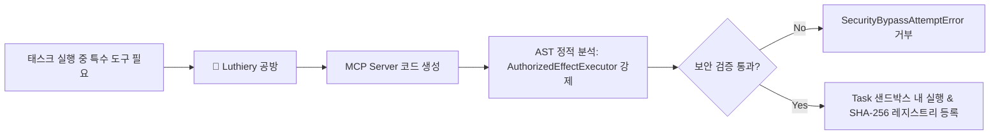

# 단계별 로드맵 및 구현 현황 (Phases & Roadmap)

Maestro는 각 단계의 검증 증거가 완료되어야 다음 단계로 진입하는 엄격한 단계별(Phased) 릴리즈 모델을 따릅니다.

---

## 1. 단계별 로드맵 전체 현황

| 단계 | 명칭 | 상태 | 핵심 산출물 및 검증 기준 |
| :--- | :--- | :---: | :--- |
| **Phase 1** | Technical Foundation & Durable Control Plane | **코드/테스트 완료, 운영 승인 보류** | Fastify 서버, PostgreSQL 17 영속성, 펜싱 토큰 리스, Prime 어댑터 격리 |
| **Phase 2** | Secretary Office Core & Hierarchical Execution | **코드/테스트 완료, 운영 승인 보류** | Overture Crew 접수, Task Contract, Head Council 심의, Department Plans, Git 격리 실행 |
| **Phase 3** | Overwatch, Certification & First Usable Release | **코드/테스트 완료, 운영 승인 보류** | Sentinel 모니터링, Overwatch Council, Quality 독립 인증, Sane 최종 리포트, CLI/App Parity |
| **Phase 4** | Isolated Environments, Devices & Firefly | **코드/테스트 완료 (자체 검증만), 운영 승인 보류** | 컨테이너/샌드박스 환경 레시피, Playwright 브라우저, 디바이스 등록, Firefly 인시던트 감지 |
| **Phase 5** | Concurrent Goals & Portfolio Control | 예정 | 다중 Goal 동시 실행 격리, 예산/컴퓨팅 경합 시 포트폴리오 우선순위 제어 |
| **Phase 6** | Overwatch Learning & 10-Axis Adaptation | 예정 | 리플레이/가상 환경 실험, 10개 성격 축(Persona Axes) 튜닝, 지식 큐레이션 |
| **Phase 7** | Full Secretary Office & Radial Control Surface | 예정 | 풀기능 웹 UI(Secretary Office) 완성, 방사형(Radial) 대시보드 |
| **Phase 8** | Full-System Hardening & Release Certification | 예정 | 적대적 장애 주입, 보안 침투 감사, 지속 부하 검증 및 릴리즈 프리즈 |

---

## 2. 향후 확장: Luthiery (동적 MCP 및 도구 제작 공방)

Phase 8 완료 이후 확장 기능으로 기획된 **Luthiery(루티어리)** 모듈의 핵심 명세입니다 ([`plan/post-phase8-ideas.md`](file:///home/ubuntu/projects/ms/plan/post-phase8-ideas.md)).

* **동적 MCP 생성**: 작업 도중 필요한 전용 도구(MCP Server)를 런타임에 안전하게 제작.
* **AST 강제 검증**: 생성된 모든 도구 핸들러는 반드시 `AuthorizedEffectExecutor`를 통과하도록 정적 분석 강제.
* **재사용 및 캐싱**: SHA-256 해시로 도구를 영속화하여 이후 유사 태스크에서 재생성 없이 재사용.
* **토큰 최적화**: 장황한 출력을 압축하고 불필요한 메타데이터를 제거하여 토큰 낭비 방지.

> **2026-09-04 운영 사용성 감사 결과 — 중요:** 위 "코드/테스트 완료" 표시는 각 단계의 도메인/영속성 계층에 대한 실 PostgreSQL 통합 테스트 통과를 의미할 뿐입니다. 독립 감사 결과 Phase 1-3의 실제 제어 평면은 워커 재시작 세션 복구, 실제 이펙트 어댑터(Git 등)의 권한 강제, Contract→Council→Plan→Worker→Git→인증 전 구간 실서비스 API 경로, 프로젝트 스코프 인가, 사용자 대면 CEO 승인/critical action 완결, 상시 Sentinel 관찰이 아직 없어 "정상 사용 가능한 시스템"으로 승인되지 않았습니다. Phase 4의 기기(Device) 조작도 실제 기기 에이전트 전송/상호인증, 로컬 Goal/grant/fencing 검증, 서명된 명령/영수증, 기기 revoke 연쇄, scope 강제, 연결 끊김 처리, Sentinel 기기 관찰, 자동 만료 상태 전이가 없어 자체 검증 수준에 머물러 있습니다. 상세 항목과 수정 계획은 `task_plan.md`의 "Phase 5 remediation plan — operational usability"를 참조하십시오. 이 표는 그 계획이 완료되기 전까지 "실사용 준비 완료"로 해석되어서는 안 됩니다.
